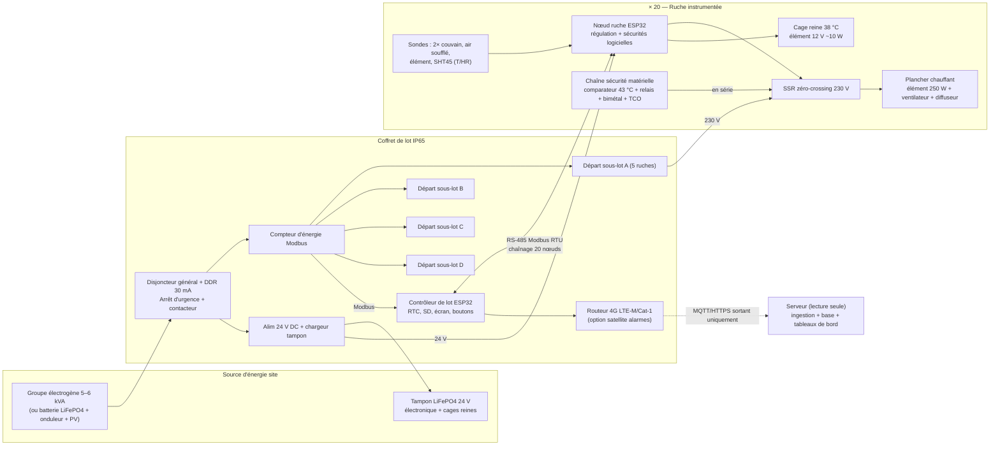
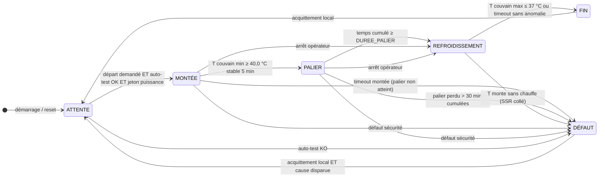

# Architecture — Thermothérapie varroa instrumentée

> Statut : **proposition à valider** (Prompt 0 — cadrage). Aucun code n'est écrit tant que ce document n'est pas validé.
> Les valeurs marquées **[H]** sont des **hypothèses non vérifiées** : elles doivent être confirmées par mesure (Phase 1) ou par l'apiculteur (section 7).

---

## 0. Principes directeurs

1. **L'automate local est souverain.** Chaque ruche est pilotée par son propre nœud, qui décide seul de chauffer ou non. Le contrôleur de lot ne fait que **coordonner** (budget de puissance, départs échelonnés, collecte de données). Le serveur distant est en **lecture seule** : aucun canal de commande entrant n'existe dans le firmware.
2. **Sûr par défaut (fail-safe).** Tout organe de chauffe est « normalement ouvert » : perte d'alimentation, plantage MCU, câble coupé, sonde absente → **pas de chauffe**. Un traitement incomplet est acceptable ; une surchauffe ne l'est jamais.
3. **Défense en profondeur.** La sécurité ne repose jamais sur le seul logiciel : une chaîne matérielle indépendante du MCU coupe la chauffe au-delà de **43,0 °C** au point le plus chaud accessible aux abeilles.
4. **Même matériel de la mono-ruche au lot de 20.** Le « nœud ruche » de la Phase 1 est la brique unitaire de la Phase 5 ; on ajoute autour un contrôleur de lot, un bus et un coffret de puissance, sans refaire le nœud.
5. **Données scientifiques exploitables.** Horodatage fiable, identifiants de sonde, paramètres de traitement et version firmware sont journalisés avec chaque mesure.

---

## 1. Architecture matérielle

### 1.1 Vue d'ensemble — lot de 20 (cible Phase 5)



### 1.2 Vue en coupe d'une ruche équipée

```
                ┌──────────────────────────────────────┐
                │  Toit d'origine (Ph.1) / capot isolé │  ← boîtier nœud fixé à l'extérieur (Ph.1)
                │  intégrant le boîtier nœud (Ph.6)    │     ou intégré au capot (Ph.6)
                ├──────────────────────────────────────┤
                │  Couvre-cadre percé : passage sondes │──── SHT45 (T/HR) sous couvre-cadre
                ├──────────────────────────────────────┤
                │  ║  ║  ║  ║ T1 ║  ║  ║  ║  ║  ║     │  T1 : couvain HAUT (≈ 5 cm sous tête de cadre)
   Corps Nicot  │  ║  ║  ║  ║    ║  ║  ║  ║  ║  ║     │       entre cadres centraux
   (cadres)     │  ║  ║  ║  ║ T2 ║  ║  ║  ║  ║  ║     │  T2 : couvain BAS (≈ 15 cm sous tête)
                │  ║  ║  ║  ║    ║  ║  ║  ║  ║  ║     │
                ├──────────────────────────────────────┤
                │ ▒▒▒▒ Diffuseur perforé (grille) ▒▒▒▒ │  T3 + NTC sécu : air soufflé / face supérieure
   Plancher     │   ↑ air tiède homogénéisé ↑          │       du diffuseur = point le plus chaud
   chauffant    │ [VENTILO]→ ═══ tapis silicone ═══ ←┐ │  T4 + bimétal + TCO : collés sur l'élément
   (remplace ou │   ← reprise d'air (recirculation) ─┘ │
   obture le    │  isolant sous l'élément              │
   fond grillagé)└──────────────────────────────────────┘
                   trou de vol réduit (cf. point ouvert)
```

### 1.3 Description des blocs

| Bloc | Rôle | Contenu | Phase d'introduction |
|---|---|---|---|
| **Nœud ruche** | Régulation et sécurités logicielles d'**une** ruche, autonome | ESP32 (module WROOM-32E ou S3), bus 1-Wire sondes, I²C (SHT45, FRAM, RTC en Ph.1), µSD (peuplée en Ph.1, optionnelle ensuite), transceiver RS-485 isolé (non peuplé en Ph.1), LED tricolore, bouton départ/acquittement, sortie SSR via « enable dynamique », sortie MOSFET cage reine, entrée tachymètre ventilateur, retour d'état de la chaîne de sécurité | Ph.1 |
| **Chaîne de sécurité matérielle** | Coupure de chauffe **indépendante du MCU** | Comparateur analogique + NTC dédiée (seuil 43,0 °C, auto-maintien, réarmement manuel), relais électromécanique en série avec le SSR, bimétal réarmement manuel + fusible thermique (TCO) sur l'élément | Ph.1 (bimétal/TCO), Ph.2 (comparateur) |
| **Plancher chauffant** | Produire et répartir la chaleur sans point chaud accessible | Caisson au format Nicot, tapis silicone 230 V classe II, ventilateur 12 V à roulement à billes en recirculation, diffuseur perforé, isolant inférieur | Ph.1 |
| **Cage reine** | Maintenir la reine à 38 °C pendant 24 h, hors volume chauffé à 41 °C | Micro-enceinte isolée, élément résistif 12 V ~10 W (TBTS), 1 sonde dédiée + bimétal 40 °C | Ph.3 |
| **Contrôleur de lot** | Coordination de 20 nœuds : départs échelonnés, budget de puissance, horodatage commun, journal centralisé, télémétrie | ESP32-S3, RS-485 maître, RTC DS3231, µSD industrielle, écran + boutons (départ lot, acquittements), lecture compteur d'énergie, lien Ethernet/Wi-Fi vers le routeur | Ph.5 (Ph.4 en version mono-ruche) |
| **Coffret de lot** | Distribution et protection électrique | Disjoncteur général, DDR 30 mA type A, arrêt d'urgence coup-de-poing sur contacteur général, 4 départs disjonctés (1 par sous-lot), prises IP67, alimentation 24 V DC + tampon LiFePO4, compteur d'énergie Modbus | Ph.5 |
| **Faisceau** | Relier coffret ↔ ruches | Par ruche : câble H07RN-F 3G1,5 (230 V chauffe) + câble 4 conducteurs blindé (24 V, 0 V, A, B) chaîné de ruche en ruche | Ph.5 |
| **Routeur / liaison** | Remontée des données, alarmes sortantes | Routeur 4G industriel (LTE-M/Cat-1), option module satellite pour alarmes courtes | Ph.4 |
| **Serveur** | Stockage, visualisation, export scientifique | Broker MQTT + base séries temporelles + tableaux de bord, hébergeable sur infrastructure virtualisée existante | Ph.4 |

### 1.4 Évolution mono-ruche → lot de 20

| | Phase 1–3 (mono-ruche) | Phase 5 (lot de 20) |
|---|---|---|
| Nœud ruche | Identique (même PCB / même firmware cible `noeud_ruche`) | Identique, RS-485 peuplé, µSD optionnelle |
| Alimentation nœud | Petit bloc 230 V → 12 V/24 V local | 24 V DC distribué depuis le coffret (tampon batterie : l'électronique survit à une coupure du groupe et journalise) |
| Départ du cycle | Bouton local du nœud | Bouton « départ lot » du contrôleur, puis jetons de départ échelonnés |
| Journal | µSD du nœud | Tampon FRAM/flash du nœud + µSD du contrôleur (le nœud garde un historique court de secours) |
| Télémétrie | Wi-Fi local / USB (Ph.1–3), puis contrôleur mono-ruche (Ph.4) | Contrôleur de lot → routeur 4G |
| Puissance | Prise secteur / batterie portable | Coffret + groupe ou batterie |

**Choix structurant retenu : architecture distribuée (1 MCU par ruche)** plutôt qu'un contrôleur central pilotant 20 relais via de longs câbles de sondes :
- chaque ruche garde sa sécurité locale même si le contrôleur tombe ;
- pas de bus 1-Wire ni de signaux analogiques sur des dizaines de mètres (fragiles, bruités) ;
- le prototype Phase 1 *est* la brique de série, ce qui valide la sécurité une fois pour toutes ;
- surcoût : ~20 ESP32 + transceivers, soit quelques centaines d'euros **[H]**, négligeable devant le coût d'une colonie perdue.

> ⚠️ Écart avec `MARCHE_A_SUIVRE.md` (Prompt 5 : « 1 sonde + 1 relais par ruche ») : **une seule sonde par ruche ne permet ni de détecter une sonde incohérente, ni de surveiller le point le plus chaud**. Minimum recommandé en série : 2 sondes couvain + 1 sonde air soufflé + NTC de sécurité matérielle. Voir point ouvert n° 8.

---

## 2. Architecture logicielle

### 2.1 Modules firmware

Base de code unique PlatformIO (framework ESP-IDF ou Arduino-ESP32 sur FreeRTOS), deux cibles : `noeud_ruche` et `controleur_lot`, plus une cible `native` pour les tests unitaires sur PC.

| Module | Cible | Responsabilité | Tâche / priorité FreeRTOS |
|---|---|---|---|
| `hal` | les deux | GPIO, 1-Wire, I²C, UART RS-485, sortie SSR à enable dynamique | — |
| `capteurs` | nœud | Acquisition (période 2 s), filtrage (médiane 5 points), application des offsets d'étalonnage par ID de sonde, statut de validité par sonde | haute |
| `securite` | nœud | **Supervision indépendante de la régulation** : seuils, plausibilité, cohérence, sonde figée, SSR collé, ventilateur, temps max ; a le **dernier mot** sur la sortie chauffe ; rafraîchit le watchdog uniquement si toutes les tâches critiques sont vivantes | la plus haute |
| `regulation` | nœud | PID (ou PI) en cascade : boucle lente sur T cœur, sortie limitée par une boucle sur T air soufflé ; anti-windup ; rampe de consigne ; sortie = rapport cyclique sur période de 10 s (SSR zéro-crossing) | haute |
| `machine_etats` | nœud | États ATTENTE → MONTÉE → PALIER → REFROIDISSEMENT → FIN / DÉFAUT (§2.2) ; persistance de l'état et des compteurs en FRAM | moyenne |
| `reine` | nœud | Second canal de régulation 38 °C / 24 h, mini-machine à états propre, sécurités propres | moyenne |
| `parametres` | les deux | Lecture/écriture NVS, **CRC**, version de schéma, **bornes figées à la compilation** (ex. consigne palier ∈ [39,0 ; 41,5] °C, impossible à dépasser par configuration) | — |
| `journal` | les deux | Enregistrement horodaté (CSV + en-tête de métadonnées), événements, résumé de cycle ; écriture FRAM immédiate des événements critiques ; µSD en tampon | basse |
| `horloge` | les deux | RTC, synchronisation (contrôleur → nœuds via bus ; contrôleur ← NTP/GNSS si dispo) | basse |
| `bus` | les deux | Modbus RTU : esclave (nœud), maître (contrôleur), battement de cœur 1 s | moyenne |
| `puissance` | contrôleur | Ordonnancement des sous-lots, jetons de départ, **décalage de phase** des fenêtres de chauffe des nœuds dans la période de 10 s pour lisser la puissance instantanée, lecture du compteur | moyenne |
| `telemetrie` | contrôleur | Publication **sortante uniquement** (MQTT/TLS ou HTTPS), file d'attente persistante sur µSD, numéros de séquence, reprise après coupure ; **aucun abonnement à des commandes** | basse |
| `ihm` | les deux | LED, bouton(s), buzzer, écran (contrôleur) ; configuration locale uniquement (USB ou point d'accès Wi-Fi activé par appui physique long) | basse |
| `diag` | les deux | Auto-test au démarrage, test de la chaîne de sécurité, compteurs d'erreurs, version firmware/paramètres | — |

Règles de conception :
- `securite` lit les mêmes capteurs que `regulation` mais **ne dépend pas** de `regulation` ni de `machine_etats` ; la commande SSR effective = `regulation.sortie ET securite.autorisation`.
- Aucune OTA à distance : mise à jour firmware **sur site uniquement**, par câble.
- Paramètres de traitement figés au départ du cycle (instantané journalisé dans l'en-tête de fichier).

### 2.2 Machine à états du nœud ruche (canal couvain)

Valeurs par défaut des paramètres (toutes paramétrables **dans des bornes figées**) :

| Paramètre | Défaut | Commentaire |
|---|---|---|
| `T_CONSIGNE_PALIER` | 40,5 °C | milieu de la plage 40–41 °C |
| `T_PALIER_MIN` | 40,0 °C | seuil de comptage du temps de palier (sur la **plus froide** des sondes couvain) |
| `T_COEUR_MAX_REG` | 41,5 °C | au-delà : chauffe forcée à 0 (non bloquant) |
| `T_COEUR_DEFAUT` | 42,0 °C pendant 60 s | → DÉFAUT |
| `T_AIR_MAX_REG` | 42,0 °C | limite de la boucle air soufflé |
| `T_AIR_DEFAUT` | 42,5 °C pendant 10 s | → DÉFAUT (le matériel coupe à 43,0 °C) |
| `PENTE_RAMPE` | 0,1 °C/min sur la consigne | évite le choc thermique et le dépassement |
| `DUREE_PALIER` | 150 min (borne 120–180) | temps **cumulé** au-dessus de `T_PALIER_MIN` |
| `TIMEOUT_MONTEE` | 150 min | au-delà : « palier non atteint » |
| `T_FIN_REFROID` | 37,0 °C | fin du refroidissement |
| `TIMEOUT_REFROID` | 90 min | |
| `DUREE_CHAUFFE_MAX` | 6 h | durée absolue max chauffe active, toutes phases |
| `ECART_SONDES_MAX` | 3,0 °C en palier | incohérence entre sondes couvain **[H]** à ajuster en Ph.1 |



#### Détail des états

**ATTENTE** — chauffe interdite, ventilateur arrêté, acquisition et journal actifs (période 60 s).
- Auto-test : toutes les sondes présentes (CRC 1-Wire OK, ID connus et étalonnés), valeurs plausibles ([−10 ; 60] °C), T couvain dans [15 ; 39] °C (sinon sonde mal placée ou colonie anormale), chaîne de sécurité matérielle fermée (lecture du retour d'état), ventilateur testé (tachymètre), paramètres valides (CRC), RTC valide, alimentation présente.
- µSD absente ou bus absent = **avertissement** (LED orange), pas de blocage en mono-ruche ; en mode lot, l'absence de bus empêche le départ.
- Sortie → MONTÉE : départ (bouton local en mono-ruche, ordre de lot + jeton en mode lot) **ET** auto-test OK.

**MONTÉE** — ventilateur à vitesse douce, consigne en rampe de `T couvain initiale` vers 40,5 °C ; régulation en cascade (la puissance est limitée pour que T air soufflé ≤ 42,0 °C) ; journal toutes les 10 s.
- → PALIER : T couvain **min** ≥ 40,0 °C pendant 5 min consécutives.
- → DÉFAUT : `TIMEOUT_MONTEE` dépassé (« palier non atteint » : élément HS, ruche ouverte, sonde hors couvain, puissance insuffisante par temps froid) ; ou défaut de sécurité (§3.1).
- Détection « chauffe inefficace » : rapport cyclique > 80 % pendant 20 min avec ΔT couvain < 0,5 °C → DÉFAUT.

**PALIER** — consigne 40,5 °C, chronomètre de palier **cumulatif** : il ne compte que lorsque T couvain min ≥ 40,0 °C **et** T couvain max ≤ 41,5 °C.
- → REFROIDISSEMENT : temps cumulé ≥ `DUREE_PALIER`.
- Chute sous 40,0 °C : comptage suspendu, régulation continue ; si le temps cumulé hors plage dépasse 30 min → DÉFAUT « palier perdu » (traitement déclaré incomplet).
- T couvain max > 41,5 °C : chauffe forcée à 0 jusqu'à retour < 41,0 °C (non bloquant, journalisé).

**REFROIDISSEMENT** — chauffe interdite, ventilateur en brassage pendant 15 min puis arrêté (la colonie reprend la main). Vérifie que la chaleur décroît réellement.
- → FIN : T couvain max ≤ 37,0 °C, ou `TIMEOUT_REFROID` atteint avec décroissance constatée (avertissement journalisé).
- → DÉFAUT : T couvain ou T air **monte** de plus de 0,5 °C en 10 min alors que la commande est à 0 → SSR collé présumé ; le nœud ouvre aussi le relais de sécurité série.

**FIN** — chauffe interdite, résumé de cycle écrit (durée montée, temps cumulé de palier, T max atteintes par sonde, énergie estimée, défauts/avertissements), LED verte fixe. Attend un acquittement local pour revenir en ATTENTE (**aucun redémarrage automatique**).

**DÉFAUT** — état **verrouillé** :
- SSR commandé à 0, relais de sécurité série ouvert par le MCU, élément de cage reine non concerné sauf défaut propre à ce canal ;
- ventilateur maintenu en brassage si le défaut est une surtempérature (casse le point chaud près de l'élément), arrêté sinon (ex. défaut ventilateur) ;
- LED rouge + code de défaut, alarme remontée par télémétrie ;
- sortie **uniquement** par acquittement **sur site** (bouton), et seulement si la cause a disparu ; retour en ATTENTE, jamais directement en chauffe. La télésurveillance ne peut pas acquitter.

#### Canal reine (mini-machine indépendante, Phase 3)
`ATTENTE → MONTÉE (vers 38,0 °C) → MAINTIEN (24 h cumulées dans [37,5 ; 38,5] °C) → FIN`, + `DÉFAUT` (coupure logicielle à 39,0 °C, bimétal matériel ~40 °C **[H]**). Un défaut du canal reine n'arrête pas le canal couvain et inversement, mais les deux sont signalés.

### 2.3 Contrôleur de lot (Phase 5)

- **Séquencement** : 4 sous-lots de 5 ruches (A, B, C, D). Le sous-lot N+1 reçoit son jeton de départ quand le sous-lot N est entré en PALIER (ou après un délai max), de sorte qu'**un seul sous-lot soit en montée** à la fois.
- **Lissage** : la période de chauffe de 10 s de chaque nœud est décalée (créneaux attribués par le contrôleur) → la puissance instantanée appelée ≈ la puissance moyenne.
- **Budget** : puissance plafond paramétrable (défaut 3,5 kW pour un groupe 5–6 kVA) ; aucun nouveau jeton si le compteur dépasse 85 % du plafond.
- **Perte du contrôleur ou du bus (battement de cœur absent > 10 s)** : les nœuds en PALIER ou REFROIDISSEMENT poursuivent seuls ; les nœuds en MONTÉE plafonnent leur rapport cyclique à 50 % ; les nœuds en ATTENTE ne démarrent pas. Pire cas résiduel : surcharge du groupe → coupure → retour au cas « perte d'alimentation », sûr.

---

## 3. Stratégie de sécurité en couches

Objectif : **aucune surface ni aucun flux d'air accessible aux abeilles au-dessus de 43 °C**, même en cas de défaillance simple (plantage logiciel, SSR collé en court-circuit, sonde déplacée, ventilateur bloqué).

| Couche | Moyen | Seuil | Indépendant du MCU ? | Réarmement |
|---|---|---|---|---|
| **C0 — Conception** | Densité de puissance limitée (~0,15 W/cm²), élément sous diffuseur inaccessible aux abeilles, brassage d'air, bornes de paramètres figées à la compilation | — | oui | — |
| **C1 — Logiciel régulation** | Cascade cœur/air, limites `T_COEUR_MAX_REG` / `T_AIR_MAX_REG` | 41,5 / 42,0 °C | non | automatique |
| **C2 — Logiciel supervision** (module `securite`) | Seuils, plausibilité, cohérence, sonde figée, palier non atteint, SSR collé, ventilateur, durée max, watchdog | 42,0 / 42,5 °C | non | DÉFAUT verrouillé, acquittement local |
| **C3 — Watchdogs** | Watchdog de tâches ESP-IDF + watchdog **externe** (circuit dédié type TPL5010/STWD100) + **enable dynamique** du SSR | — | partiellement | reset MCU → ATTENTE |
| **C4 — Coupure matérielle air** | Comparateur analogique + NTC dédiée au point le plus chaud (face supérieure du diffuseur) → relais électromécanique **en série** avec le SSR, à auto-maintien | **43,0 °C** | **oui** | **manuel** (bouton sur boîtier) |
| **C5 — Coupure matérielle élément** | Thermostat bimétal à réarmement manuel collé sur l'élément + fusible thermique (TCO) non réarmable en série | à fixer en Ph.1 **[H]** (≈ T élément max en régime normal + 10 °C, typiquement 60–75 °C) | **oui** | manuel / remplacement |
| **C6 — Électrique** | DDR 30 mA, disjoncteurs, arrêt d'urgence sur contacteur général, éléments classe II, connectique IP67 | — | oui | manuel |

### 3.1 Sécurités logicielles (C1–C3) — détail

- **Seuils** : voir tableau des paramètres §2.2. Les seuils de défaut sont évalués sur valeur filtrée **et** sur valeur brute (une valeur brute > 43 °C répétée 3 fois = DÉFAUT immédiat).
- **Sonde HS** : CRC 1-Wire en échec 3 fois consécutives, valeur hors [−10 ; 60] °C, valeur « usine » (85,0 °C ou −127 °C pour un DS18B20), ID inconnu → DÉFAUT si la sonde est critique (couvain, air soufflé), avertissement sinon (SHT45).
- **Sonde incohérente** :
  - écart entre les deux sondes couvain > `ECART_SONDES_MAX` en PALIER ;
  - T couvain > T air soufflé + 1 °C pendant la chauffe (physiquement impossible si la chaleur vient du plancher → sonde inversée ou défaillante) ;
  - pente > 2 °C/min ;
  - valeur figée (variation < 0,05 °C pendant 10 min alors que la chauffe est active).
- **Sonde déplacée hors du couvain** (cas dangereux : elle lit froid, la régulation pousse) : couverte par la limite air soufflé (C1/C2/C4) et par la détection « chauffe inefficace ».
- **Palier non atteint / perdu** : `TIMEOUT_MONTEE`, cumul hors plage > 30 min.
- **SSR collé** : température qui monte avec commande à 0 → ouverture du relais série par le MCU + DÉFAUT ; si le MCU est lui-même défaillant, C4/C5 prennent le relais.
- **Ventilateur** : tachymètre absent ou < 50 % de la consigne pendant 10 s → DÉFAUT (sans brassage, l'élément crée un point chaud).
- **Durée max de chauffe** : 6 h toutes phases confondues → DÉFAUT.
- **Watchdog et enable dynamique** : le SSR n'est alimenté que si le MCU fournit un **signal carré** (ex. 1 kHz) à travers une pompe de charge / un monostable redéclenchable. Un MCU figé (sortie bloquée à 0 ou à 1) ou en reset → plus de signal → SSR ouvert. La tâche `securite` ne rafraîchit le watchdog externe que si les tâches `capteurs`, `regulation` et `machine_etats` ont toutes signalé leur activité dans la période.
- **Paramètres** : CRC vérifié au démarrage ; paramètres corrompus → valeurs par défaut compilées + DÉFAUT d'auto-test (pas de départ).

### 3.2 Sécurités matérielles indépendantes (C4–C5)

- **C4** : NTC 10 kΩ 1 % + pont de résistances 0,1 % + comparateur à hystérésis → précision visée ±0,3 °C autour de 43,0 °C **[H]**, nettement meilleure qu'un bimétal (tolérance typique ±3 à ±5 °C, inutilisable seul pour un seuil à 43 °C). Le relais de sécurité est **excité au repos** (sécurité positive) : perte d'alimentation de la carte, NTC débranchée (lecture « froid » à éviter → câblage choisi pour qu'une NTC coupée ou en court-circuit fasse retomber le relais) ou dépassement → relais ouvert. Contact d'auto-maintien + bouton de réarmement. Le MCU lit l'état du relais et peut l'ouvrir, **jamais le forcer fermé**.
- **Test de la chaîne C4 à la pose** : bouton « test sécurité » qui commute une résistance simulant 44 °C → le relais doit retomber (LED), puis réarmement manuel. Fait partie de la check-list de pose.
- **C5** : bimétal à réarmement manuel + TCO, directement sur l'élément, en série dans le circuit 230 V. Protège contre l'emballement de l'élément (SSR collé + ventilateur bloqué + carte morte).

### 3.3 Perte d'alimentation

| Situation | Comportement |
|---|---|
| Coupure du 230 V (groupe en panne/à sec, disjonction) | Chauffe arrêtée physiquement (fail-safe). En mode lot, l'électronique reste alimentée par le tampon 24 V : détection de l'absence secteur (entrée opto), journalisation, alarme télémétrie. En mono-ruche sans tampon : la détection de chute (brown-out) écrit l'événement en FRAM en < 1 ms. |
| Retour du 230 V **< 15 min** après la coupure, nœud en MONTÉE/PALIER | Reprise **autorisée** si l'état persistant (FRAM) est cohérent, l'auto-test repasse, et la durée totale reste dans `DUREE_CHAUFFE_MAX`. Le temps de palier déjà cumulé est conservé. |
| Retour **> 15 min**, ou état FRAM incohérent, ou reboot inexpliqué | Pas de reprise : passage en DÉFAUT « traitement interrompu », journal de l'interruption. L'apiculteur décide sur site. |
| Perte totale (tampon vide) | Au redémarrage : ATTENTE, aucun départ sans action locale. |
| Coupure de l'alimentation de la cage reine | La reine refroidit vers l'ambiante dans sa cage : non dangereux à court terme **[H]**, mais signalé ; la durée de 24 h est comptée en cumulé. |

### 3.4 Perte de liaison

| Liaison perdue | Effet sur le traitement | Effet sur les données |
|---|---|---|
| Serveur / 4G | **Aucun** (lecture seule) | Mise en file sur µSD, envoi différé avec numéros de séquence, aucune perte jusqu'à la capacité de la carte (plusieurs mois) |
| Bus RS-485 nœud ↔ contrôleur | Voir §2.3 (poursuite autonome des cycles en cours, pas de nouveau départ) | Le nœud conserve en FRAM/flash un historique de secours (≥ 24 h à 1 point/min **[H]** selon taille mémoire), récupéré à la reconnexion |
| Sonde | Voir §3.1 | Événement journalisé |

---

## 4. Choix technologiques justifiés

### 4.1 Microcontrôleur — **ESP32** (WROOM-32E pour le nœud, ESP32-S3 pour le contrôleur)

| Option | Verdict | Raison |
|---|---|---|
| **ESP32 / ESP32-S3** | **Retenu** | Coût faible (< 10 € le module), double cœur + FreeRTOS (tâche sécurité isolée), Wi-Fi/BLE pour configuration locale, écosystème PlatformIO, UART/I²C/1-Wire suffisants, NVS + chiffrement flash. **Réserve** : ADC interne médiocre → aucune mesure de sécurité n'utilise l'ADC de l'ESP32 (capteurs numériques ou comparateur matériel). |
| STM32 (G0/L4) | Écarté | Plus déterministe, meilleur ADC, mais pas de radio intégrée et temps de développement plus long ; avantage non déterminant puisque la sécurité ultime est matérielle. |
| RP2040 / Pico W | Écarté | Écosystème moins mûr pour le stockage et la radio, peu d'avantage. |
| Raspberry Pi | Écarté pour le nœud | Démarrage long, système de fichiers sur SD sensible aux coupures, pas temps réel. Envisageable seulement comme passerelle. |
| Automate industriel (type LOGO!, Controllino) | Écarté | Robuste mais ×5 à ×10 en coût par ruche, journalisation et télémétrie moins souples. |

### 4.2 Sondes — **5 points de mesure par ruche** (+1 pour la cage reine)

| Repère | Emplacement | Capteur proposé | Usage |
|---|---|---|---|
| T1 | Couvain haut : entre les 2 cadres centraux du nid, ~5 cm sous la tête de cadre, introduite par le couvre-cadre | DS18B20 en tube inox Ø 4–6 mm, câble silicone | régulation + comptage palier |
| T2 | Couvain bas : même ruelle, ~15 cm sous la tête de cadre | DS18B20 idem | régulation + cohérence |
| T3 | Air soufflé : face supérieure du diffuseur, au droit de l'élément | DS18B20 | limite 43 °C logicielle |
| T4 | Surface de l'élément chauffant | DS18B20 (ou NTC haute température) | diagnostic élément, réglage C5 |
| H1 | Sous le couvre-cadre | **SHT45** avec membrane PTFE (version filtrée) | T/HR ambiance haute, données scientifiques, détection condensation |
| S | Au plus près de T3 | NTC 10 kΩ 1 % dédiée | **coupure matérielle C4 uniquement**, non lue par le MCU |
| R | Cage reine | DS18B20 | canal reine (Ph.3) |

Justification :
- **DS18B20** : bus 1-Wire unique pour 4–5 sondes (ID unique = traçabilité scientifique), étanche, bon marché. Précision brute ±0,5 °C, insuffisante entre 40,5 °C et 43 °C → **étalonnage d'un point à 40 °C au bain thermostaté** contre un thermomètre de référence, offsets stockés par ID. Acheter chez un distributeur reconnu (nombreuses contrefaçons). Alternative si dérive : **TMP117** (I²C, ±0,1 °C sans étalonnage, plus cher, câblage I²C plus délicat).
- **SHT45** plutôt que SHT31/DHT22 : ±0,1 °C / ±1 % HR, chauffage intégré pour décondensation ; l'hygrométrie est critique à 41 °C (évaporation de la colonie, condensation sous le couvre-cadre).
- Bulle de 8–9 mm entre rayons : un tube de 6 mm est à la limite, 4 mm préférable **[H]** ; les abeilles propolisent les sondes → prévoir le retrait/nettoyage dans la procédure.

### 4.3 Élément chauffant — **tapis silicone 230 V classe II, 250 W, dans un plancher chauffant ventilé**

| Option | Verdict | Raison |
|---|---|---|
| **Tapis silicone dans plancher + ventilateur + diffuseur** | **Retenu** | Faible densité surfacique (250 W sur ~1 600 cm² ≈ 0,15 W/cm²), répartition homogène par brassage, élément hors de portée des abeilles, rattrape le fond grillagé Nicot (qui doit être obturé pendant le traitement), fabrication simple et reproductible. |
| Résistance CTP à air pulsé | Variante possible | Autolimitante (sécurité intrinsèque), mais températures de sortie d'air locales élevées (50–70 °C typiques) → exige un mélangeage soigné ; à tester si le tapis pose problème. |
| Fils chauffants dans les cires / cadres chauffants | Écarté | Excellente homogénéité mais impose des cadres spéciaux sur 100 ruches, coût et contraintes d'exploitation. |
| Lampe / panneau infrarouge | Écarté | Rayonnement direct sur les abeilles, points chauds non maîtrisables. |
| Air chaud extérieur gainé (générateur central) | Écarté | Pertes, mauvaise répartition entre 20 ruches, régulation individuelle impossible. |

Dimensionnement **[H]** (à confirmer en Ph.1) :
- puissance nominale **250 W** par ruche, utilisée à 100 % seulement en montée ; régime de palier attendu 60–150 W selon l'ambiante ;
- 230 V AC retenu pour la compatibilité directe groupe/onduleur et des sections de câble raisonnables (≈ 1,1 A par ruche) ; **alternative TBTS 48 V DC** écartée en première intention (≈ 5,2 A par ruche, sections et pertes en ligne sur 20 ruches, mais plus sûre au contact) — à reconsidérer si la batterie devient la source principale (évite l'onduleur).
- **Ventilateur** 12 V, 80–92 mm, roulement à billes, tenue ≥ 70 °C, PWM + tachymètre, débit réduit (« ventilation douce ») en recirculation interne.

### 4.4 Actionneurs — **SSR zéro-crossing** + relais de sécurité électromécanique

- **SSR 230 V AC à passage par zéro**, calibre 10 A (≥ 8× le courant nominal, sans dissipateur volumineux), commande 3–32 V DC : silencieux, sans usure, compatible avec une commande en rapport cyclique sur période de 10 s, pas de perturbation pour le groupe électrogène.
- Mode de défaillance typique d'un SSR = **court-circuit** → d'où le **relais électromécanique en série** (C4) et le bimétal/TCO (C5).
- Écartés : relais électromécanique seul en commande (usure à 1 commutation toutes les 10 s → ~1 000 cycles/jour par ruche) ; gradateur à angle de phase (harmoniques, mauvaise cohabitation avec un groupe).
- Cage reine : MOSFET logique côté 12 V (TBTS), suffisant pour ~10 W.

### 4.5 Communication

| Lien | Choix | Alternatives écartées / options |
|---|---|---|
| Nœud ↔ contrôleur | **RS-485 Modbus RTU isolé**, 19 200–115 200 bauds, chaînage dans le même faisceau que le 24 V | CAN (TWAI natif ESP32) : très robuste mais outillage de diagnostic moins répandu ; **ESP-NOW** (sans fil) : évite un câble mais le faisceau 230 V est de toute façon posé, et le filaire est plus déterministe. Gardé en repli. |
| Contrôleur → serveur | **4G LTE-M / Cat-1** via **routeur industriel** (Ethernet ou Wi-Fi vers le contrôleur), publication sortante MQTT/TLS ou HTTPS, VPN possible | Module modem intégré (type SIM7080G) : moins de consommation mais moins d'outils de supervision. Volume estimé : ~2 ko/min pour 20 ruches à 1 point/min → quelques Mo par jour, compatible LTE-M. |
| Zones blanches | **Mode dégradé natif** : tout est journalisé localement et remonté plus tard, le traitement n'en dépend pas | **LoRa** (P2P vers une passerelle privée, portée 2–10 km **[H]** selon relief) : pertinent seulement si une passerelle peut être installée près des ruchers ; **satellite** (type Iridium SBD, messages ~300 octets, coût par message) : réservé aux **alarmes** et à un état de synthèse, pas aux séries de données. |
| Configuration | Locale uniquement : USB ou point d'accès Wi-Fi activé par appui long | Aucune configuration à distance (principe de lecture seule). |

### 4.6 Stockage local

| Support | Usage | Raison |
|---|---|---|
| **FRAM I²C** (32–256 ko, type MB85RC) | État de la machine, compteurs de palier, derniers événements, historique de secours du nœud | Écriture instantanée et endurance quasi illimitée : idéale pour sauvegarder à chaque transition et à la coupure. |
| **µSD industrielle** (pSLC, 4–8 Go) | Journaux complets CSV + résumés JSON + file d'envoi télémétrie | Capacité, lisible sur PC par l'apiculteur. Fichiers fermés/synchronisés régulièrement pour limiter les pertes en cas de coupure. |
| **NVS (flash ESP32)** | Paramètres, offsets d'étalonnage | Natif, avec CRC applicatif. |

Volume indicatif : 20 ruches × ~10 grandeurs × 1 point/10 s × 10 h ≈ 720 000 valeurs ≈ 20–30 Mo de CSV par lot.

---

## 5. Bilan de puissance estimatif

### 5.1 Hypothèses **[H]** (toutes à vérifier en Phase 1)

| N° | Hypothèse | Valeur retenue |
|---|---|---|
| H1 | Corps Nicot 10 cadres, dimensions extérieures ≈ 50 × 42 × 32 cm ; surface d'échange totale (côtés + dessus + plancher) | ≈ 1,0 m² |
| H2 | Coefficient de déperdition global paroi plastique non isolée (convection int./ext., vent faible) | U ≈ 5 W/m²·K ; avec isolation 30 mm (Ph.6) U ≈ 1–1,5 W/m²·K |
| H3 | Température ambiante de dimensionnement | 15 °C (cas défavorable) ; 25 °C (cas courant été) |
| H4 | Masse thermique ruche peuplée (miel ~12 kg, bois/cire ~4 kg, couvain+abeilles ~5 kg, plastique ~3 kg, plancher ~3 kg) | C ≈ 60 kJ/K |
| H5 | Échauffement moyen à fournir (cœur 35 → 40,5 °C, périphérie bien moins chaude) | ΔT moyen ≈ 10 K → ≈ 600 kJ ≈ 0,17 kWh |
| H6 | Renouvellement d'air par le trou de vol | ~2 m³/h → ~15–20 W |
| H7 | Chaleur métabolique de la colonie (apport) vs ventilation/évaporation par les abeilles (perte) | **Non quantifié** : les abeilles vont lutter contre l'échauffement (ventilation, évaporation d'eau). Poste potentiellement important — à mesurer. |
| H8 | Cage reine (enceinte isolée ~1 L) | ~10 W crête, ~3–5 W moyen |
| H9 | Électronique par ruche (ESP32 + capteurs + pertes alim) / ventilateur | ~1,5 W / ~3 W |

### 5.2 Par ruche

| Poste | 25 °C ambiant | 15 °C ambiant |
|---|---|---|
| Déperditions paroi (U·S·ΔT) | ≈ 80 W | ≈ 130 W |
| Renouvellement d'air | ≈ 15 W | ≈ 20 W |
| **Puissance de maintien en palier** | **≈ 95 W** | **≈ 150 W** |
| Montée en 90 min : 0,17 kWh / 1,5 h + déperditions moyennes | ≈ 110 + 70 = 180 W | ≈ 110 + 110 = 220 W |
| **Élément retenu** | **250 W** (marge ~15–40 %) | |
| Énergie par cycle (montée 1,5 h + palier 2,5 h) | ≈ 0,5 kWh | ≈ 0,7 kWh |
| Avec isolation Ph.6 (palier ≈ 40–60 W) | ≈ 0,3 kWh | ≈ 0,4 kWh |

### 5.3 Par sous-lot de 5 ruches

| Régime | Puissance |
|---|---|
| Montée simultanée des 5 (crête) | 5 × 250 W = **1,25 kW** |
| Palier (moyenne, lissée par décalage de phase) | **0,5–0,75 kW** |
| Électronique + ventilateurs | ≈ 25 W |

### 5.4 Lot de 20 ruches (4 sous-lots échelonnés de ~1 h 30)

```
Temps (h)   0     1,5    3     4,5    6     7,5    9    10
Sous-lot A  [MONTÉE][----PALIER----][REFR]
Sous-lot B         [MONTÉE][----PALIER----][REFR]
Sous-lot C                [MONTÉE][----PALIER----][REFR]
Sous-lot D                       [MONTÉE][----PALIER----][REFR]
Cages reines [=================== 24 h à 38 °C ======================...]
```

| Grandeur | Valeur estimée |
|---|---|
| Puissance crête gérée (1 sous-lot en montée + 3 en palier + 20 cages + électronique) | 1,25 + 3 × 0,75 + 0,2 + 0,1 ≈ **3,8 kW** à 15 °C ; ≈ **3,0 kW** à 25 °C |
| Comparaison sans séquencement (20 montées simultanées) | 20 × 250 W = **5 kW** + annexes → à la limite d'un groupe 5–6 kVA : **séquencement justifié** |
| Durée de la phase couvain | ≈ **9–10 h** |
| Énergie couvain | 20 × 0,5–0,7 ≈ **10–14 kWh** |
| Énergie cages reines (24 h) | 20 × ~0,1 ≈ **2–2,5 kWh** |
| Électronique + routeur (~30 h) | ≈ **1–1,5 kWh** |
| **Total par lot** | **≈ 13–18 kWh** (non isolé) ; **≈ 8–10 kWh** avec isolation Ph.6 |
| **Total campagne 100 ruches (5 lots)** | **≈ 65–90 kWh** (non isolé) |

### 5.5 Conséquences sur la source d'énergie

| Option | Atouts | Limites | Ordre de grandeur **[H]** |
|---|---|---|---|
| **Groupe 5–6 kVA (inverter de préférence)** | Puissance crête largement couverte, coût d'achat modéré, mobile | Fonctionnement **sans surveillance** pendant ~10 h (autonomie réservoir, vol, incendie, bruit), carburant ~1–1,5 L/h à mi-charge → 10–15 L par lot ; inutile de le laisser tourner 24 h pour les seules cages reines | carburant ~15 L/lot |
| **Batterie LiFePO4 + onduleur + PV** | Silencieuse, « pose et repars » natif, pas de carburant | Il faut **15–20 kWh** par lot non isolé (≈ 8–10 kWh isolé), poids 100–200 kg, coût élevé ; recharge PV : 2 kWc ≈ 8–10 kWh/jour en été dans le Gers → environ 1 lot tous les 2 jours | batterie + onduleur : plusieurs milliers d'euros |
| **Hybride recommandé (Ph.5)** | Groupe pour la phase couvain (~10 h) + **tampon LiFePO4 24 V de 2–3 kWh** pour électronique et cages reines (24 h) | Deux sources à gérer | — |

Recommandation : **décider la source définitive après la Phase 6** (isolation), qui divise le besoin environ par deux et peut rendre l'option tout-batterie réaliste.

---

## 6. Arborescence cible du dépôt

```
thermo-varroa/
├── README.md
├── MARCHE_A_SUIVRE.md
├── docs/
│   ├── architecture.md              # ce document
│   ├── journal-tests.md
│   ├── decisions/                   # une fiche par décision structurante (ADR)
│   ├── securite/
│   │   ├── analyse-risques.md       # AMDEC : défaillance → effet → couche qui la couvre
│   │   └── checklist-pose.md        # dont test chaîne C4 avant départ
│   ├── format-donnees.md            # Ph.4
│   └── procedures/                  # pose sur rucher, cage reine, réintroduction, dépose
├── hardware/
│   ├── bom-phase1.md
│   ├── cablage-phase1.md
│   ├── noeud-ruche/                 # schéma + PCB (KiCad), nomenclature
│   ├── chaine-securite/             # comparateur 43 °C, relais, bimétal, TCO
│   ├── plancher-chauffant/          # plans mécaniques (STEP/FreeCAD), diffuseur
│   ├── cage-reine/                  # Ph.3
│   ├── controleur-lot/              # Ph.5
│   ├── coffret-puissance/           # Ph.5 : unifilaire, protections
│   └── capot-isole/                 # Ph.6
├── firmware/
│   ├── platformio.ini               # envs : noeud_ruche, controleur_lot, native
│   ├── include/
│   │   └── parametres_defaut.h      # valeurs par défaut + bornes figées
│   ├── lib/
│   │   ├── hal/
│   │   ├── capteurs/
│   │   ├── securite/
│   │   ├── regulation/
│   │   ├── machine_etats/
│   │   ├── reine/
│   │   ├── parametres/
│   │   ├── journal/
│   │   ├── horloge/
│   │   ├── bus/
│   │   ├── puissance/
│   │   ├── telemetrie/
│   │   ├── ihm/
│   │   └── diag/
│   ├── src/
│   │   ├── noeud/main.cpp
│   │   └── controleur/main.cpp
│   └── test/                        # tests unitaires (Unity, env native) : machine à états, sécurité, PID
├── server/
│   ├── ingestion/                   # récepteur MQTT/HTTPS
│   ├── stockage/                    # schéma base séries temporelles
│   ├── tableau-de-bord/
│   └── deploiement/                 # docker-compose ou équivalent
├── data/
│   ├── README.md                    # conventions de nommage, schéma des colonnes
│   ├── analyse/                     # scripts d'analyse (Ph.7)
│   └── (CSV non versionnés)
└── tests/
    ├── banc/                        # banc à vide : ruche factice, masse thermique
    ├── protocole-phase1.md
    ├── protocole-phase2-defauts.md  # simulation de chaque défaut
    └── resultats/                   # exports bruts des essais (hors CSV volumineux)
```

Note : les **tests unitaires** firmware vivent dans `firmware/test/` (convention PlatformIO) ; `tests/` à la racine regroupe les **protocoles et bancs** physiques.

---

## 7. Points ouverts à valider par l'apiculteur avant la Phase 1

1. **Modèle Nicot exact** (Dadant 10 ou 12 cadres, dimensions, présence de hausses pendant le traitement) et possibilité d'insérer un **plancher chauffant de ~6–8 cm** à la place du fond grillagé ou sous le corps.
2. **Trou de vol pendant le traitement** : laissé ouvert (réduit) ou fermé ? Faut-il traiter le soir, butineuses rentrées ? Impact direct sur la puissance et sur le risque d'asphyxie / de « barbe » à l'entrée.
3. **Cage reine** : à 38 °C elle ne peut **pas** être dans le volume chauffé à 41 °C → où la placer (hors ruche, dans le capot isolé) ? Ordre des opérations (encagement avant/pendant/après le palier couvain) et temps opérateur pour trouver 20 reines par lot. Confirmer la source du protocole 38 °C / 24 h.
4. **Valeurs de traitement** : confirmer palier 40,5 °C ± 0,5, durée 150 min par défaut (bornes 120–180), seuil absolu 43 °C au contact et seuil logiciel 42,5 °C sur l'air soufflé ; préciser les sources (littérature, retours d'expérience).
5. **Période de traitement visée** et plage de températures ambiantes attendues (dimensionne la puissance : 250 W suffit-il au printemps ?).
6. **Énergie** : groupe disponible (modèle, autonomie du réservoir) ; est-il acceptable de le laisser tourner **sans surveillance ~10 h** sur les ruchers ? Sinon, budget pour une batterie.
7. **Couverture réseau** des ruchers (liste des sites, test d'une SIM LTE-M sur place) et disposition d'un lot (espacement des ruches, longueur totale de câble).
8. **Nombre de sondes en série** : valider le minimum de 3 sondes + NTC de sécurité par ruche (au lieu de « 1 sonde » prévu au Prompt 5).
9. **Prototype Phase 1** : lieu des essais à vide (miellerie avec secteur ?), ruche Nicot dédiée au banc, puis colonie test sacrifiable pour les premiers essais avec abeilles (après validation Phase 2).
