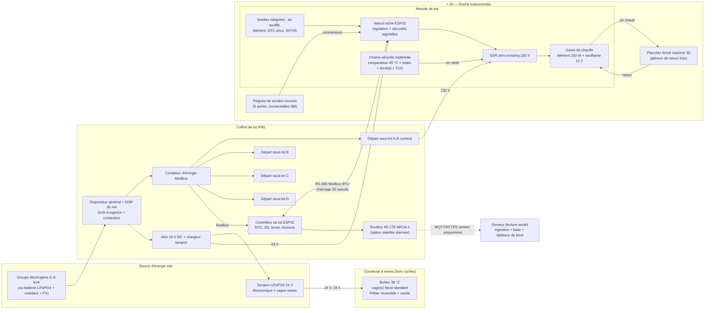

# Architecture — Thermothérapie varroa instrumentée

> Statut : **révision 2 — décisions apiculteur intégrées** (Prompt 0 — cadrage). Aucun code n'est écrit tant que ce document n'est pas validé.
> Les valeurs marquées **[H]** sont des **hypothèses non vérifiées** : elles doivent être confirmées par mesure (Phase 1) ou par l'apiculteur (section 7).

---

## Décisions validées (révision 2)

| # | Sujet | Décision |
|---|---|---|
| D1 | Emplacement de la chauffe | **Pas de plancher chauffant** : le plancher Nicot fait ~2 cm. Tout est intégré dans un **module de toit** qui remplace le toit Nicot : électronique, élément chauffant, ventilateur, sécurités. *(Complété par D21 : film TBTS d'appoint en variante, le chauffage principal reste au toit.)* |
| D2 | Répartition de la chaleur | **Boucle d'air forcée** : le toit chauffe et souffle, l'air traverse les cadres, un **plancher fermé imprimé en 3D** (≤ 2 cm, le plancher Nicot n'étant pas hermétique) sert de plénum de retour. Deux schémas de retour comparés au §1.2. |
| D3 | Sondes | **Indépendantes du toit** : peignes de sondes posés d'abord dans le couvain, puis le toit est posé et les sondes s'y **branchent** par connecteurs étanches détrompés (§4.2). Prototype : 5 points couvain (centre, 2 bords, haut, bas). |
| D4 | Reine | **Boîtier séparé, hors du toit** (le toit est la zone la plus chaude), régulé à 38 °C pendant le traitement et 24 h après, recevant une **cage de reine Nicot standard** (reine + accompagnatrices + candi). |
| D5 | Trou de vol | Fermé par une **porte Nicot classique à petites aérations**. |
| D6 | Consignes | Révisées d'après la littérature (§2.2) : **42,0 °C au point de couvain le plus froid pendant 2 h**, rampe ~20 min, paramétrable 41,0–43,5 °C pour calibration. |
| D7 | Sécurité | Régulation et chrono du palier sur la sonde couvain **la plus froide** ; coupures sur la sonde **la plus chaude**. Coupure matérielle indépendante relevée à **45,0 °C**. |
| D8 | Énergie | Groupe électrogène et bilan acceptés par l'apiculteur ; il peut tourner seul ~10 h sur les ruchers. |
| D9 | Boucle d'air | **Option A retenue** (tout interne, aucune pièce extérieure). Circulation **avant ↔ arrière, en boucle**, dans le sens des ruelles (§1.2). |
| D10 | Toit | Le module de toit est construit **dans un toit Nicot existant** (stock disponible) : on l'équipe à l'intérieur, passages de câbles par presse-étoupes étanches. |
| D11 | Saisons | Traitement en **septembre** et au **printemps**, ambiance 20–25 °C (parfois plus). **Pas de traitement en hiver** (§2.4). |
| D12 | Reines | ~5 min par ruche pour trouver et encager → ~1 h 40 par lot de 20, à faire avant le départ. |
| D13 | Données | **Stockage local sur une passerelle de lot** (mini-PC), qui décharge vers le serveur dès qu'une connexion est disponible (§4.5). |
| D14 | Soufflage par le bas avec conduits extérieurs | **Écarté** : impose des pièces extérieures et ressemble au système Hyperthermium (brevets déclarés). La boucle reste interne, chauffe dans le toit. |
| D15 | Cadres de rive | **Laissés en place** pendant le traitement : objectif de pose avec un minimum de manipulations et chauffe uniforme de toute la ruche. Le surcroît de masse thermique (réserves) est intégré au dimensionnement. |
| D16 | CO₂ | **Mesure de référence uniquement**, sur le prototype lors des **premiers essais avec abeilles** (le CO₂ n'a pas de sens à vide). Pas de trappe pilotée : aération constante par la porte Nicot. Pas d'alerte bloquante tant que des seuils n'ont pas été établis par la mesure. Le capteur n'est pas prévu en série à ce stade (coût). |
| D17 | Réintroduction de la reine | Conduite apicole classique (cage d'introduction selon les pratiques habituelles) : hors du périmètre du système. |
| D19 | Redescente | **Pilotée** en rampe vers l'état de départ (température de couvain relevée au début du cycle), pour ménager la colonie. |
| D20 | Critère d'équilibre entrée/sortie d'air | **Non retenu comme condition** : le démarrage du chrono reste « les 5 sondes couvain ≥ 42,0 °C pendant 5 min », mesure directe du couvain. L'écart air soufflé / air de retour est journalisé comme indicateur. |
| D21 | Plancher chauffant d'appoint | **Variante validée par l'apiculteur**, en plus du chauffage principal du toit (inchangé) : **film chauffant 24 V DC (TBTS, jamais de 230 V dans le plancher), 60–80 W**, ≈ 400 × 300 mm **[H]**, collé sur la plaque d'obturation du plancher fermé, dans le plénum de retour, **sous la grille** (inaccessible aux abeilles) ; surface visée ≤ 50 °C (≈ 0,06 W/cm²). Alimentation 24 V dédiée, MOSFET côté bas piloté par l'ESP32 ; il suit la **même demande de chauffe** que le toit, limite propre 50 °C, DÉFAUT à 55 °C, **interdit si les soufflantes de plancher ne tournent pas**. Sécurités indépendantes du MCU : bimétal NF 55 °C + TCO 72 °C **[H]** en série, contact de K2 (chaîne C4). Paramètre `plancher_chauffant` (défaut 0) pour l'**essai comparatif** avec / sans (protocole E14). Détails : §1.2 « Variante : plancher chauffant d'appoint », `hardware/plancher-phase1.md` §7. |
| D18 | Identification des ruches | Pas de QR code propre au projet pour l'instant. Piste pour la Phase 4 : **se greffer sur l'identification par code-barres déjà utilisée par l'apiculteur ou par des logiciels de gestion de rucher** (scan de la ruche → association du traitement). |

### Base scientifique des consignes

- Kablau et al. (FU Berlin) : 43,7 °C pendant 2 h, très efficace contre le varroa ; effets mesurés sur les ouvrières émergentes (baisse de la réponse au sucre, mais durée de vie allongée, butinage inchangé).
- Sandrock et al. 2024 (*Journal of Pest Science* 97:1433–1450) : 42,5 °C pendant 130 min après une rampe de 20 min, efficace, mais **surmortalité des œufs et jeunes larves**, baisse temporaire du nombre d'ouvrières et récolte de miel plus faible.

**Compromis assumé** : la fenêtre efficace (42–43,5 °C au couvain pendant ~2 h) coûte du jeune couvain. On démarre au bas de la fenêtre (42,0 °C) et on calibre par essais (Phase 7 : comptages varroa et couvain avant/après).

---

## 0. Principes directeurs

1. **L'automate local est souverain.** Chaque ruche est pilotée par son propre nœud, qui décide seul de chauffer ou non. Le contrôleur de lot ne fait que **coordonner** (budget de puissance, départs échelonnés, collecte de données). Le serveur distant est en **lecture seule** : aucun canal de commande entrant n'existe dans le firmware.
2. **Sûr par défaut (fail-safe).** Tout organe de chauffe est « normalement ouvert » : perte d'alimentation, plantage MCU, câble coupé, sonde absente → **pas de chauffe**. Un traitement incomplet est acceptable ; une surchauffe ne l'est jamais.
3. **Défense en profondeur.** La sécurité ne repose jamais sur le seul logiciel : une chaîne matérielle indépendante du MCU coupe la chauffe au-delà de **45,0 °C** au point le plus chaud accessible aux abeilles (sortie d'air du module de toit).
4. **Même matériel de la mono-ruche au lot de 20.** Le « nœud ruche » de la Phase 1 est la brique unitaire de la Phase 5 ; on ajoute autour un contrôleur de lot, un bus et un coffret de puissance, sans refaire le nœud.
5. **Données scientifiques exploitables.** Horodatage fiable, identifiants de sonde, paramètres de traitement et version firmware sont journalisés avec chaque mesure.

---

## 1. Architecture matérielle

### 1.1 Vue d'ensemble — lot de 20 (cible Phase 5)



### 1.2 Vue en coupe d'une ruche équipée

Ordre de pose : (1) plancher fermé sous le corps, (2) porte Nicot à aérations, (3) peignes de sondes glissés entre les cadres, (4) module de toit posé, (5) branchement des peignes sur le toit, (6) auto-test puis départ.

```
               ┌─────────────────────────────────────────┐
  MODULE       │ [Nœud ESP32][SSR][sécu C4]   isolant    │  boîtier électronique, côté froid
  DE TOIT      │  ┌─[aspiration]──[soufflante]──[élément]─┐│  T4 + bimétal + TCO sur l'élément
  (remplace    │  └─────────────── gaine de chauffe ──────┘│
  le toit      │ ▒▒ grille de soufflage (inaccessible) ▒▒ │  T3 + NTC sécu C4 : air soufflé
  Nicot)       │  ●M8  ●M8  ●M8   SHT45                   │  embases des peignes + T/HR
               ├──────↓──────↓──────↓────────────────────┤
               │  ║  ║ P2 ║  ║ P1 ║  ║  ║ P3 ║  ║  ║      │  P1 : peigne CENTRE (haut / centre / bas)
  Corps Nicot  │  ║  ║ ●  ║  ║ ●  ║  ║  ║ ●  ║  ║  ║      │  P2, P3 : peignes BORDS du couvain
  (cadres)     │  ║  ║    ║  ║ ●  ║  ║  ║    ║  ║  ║      │  → 5 points couvain
               │  ║  ║    ║  ║ ●  ║  ║  ║    ║  ║  ║      │
               ├─────────────────────────────────────────┤
  Plancher     │  ══ plénum de retour, fermé, ≤ 2 cm ══   │  imprimé 3D, étanche
  fermé 3D     └─────────────────────────────────────────┘
                 porte Nicot à petites aérations (fermée)
```

#### Boucle d'air retenue : option A, circulation avant ↔ arrière (D9)

L'air ne peut circuler facilement que **dans le sens des ruelles** (entre deux rayons) : la boucle est donc orientée dans ce sens. Vue de côté, dans l'axe d'une ruelle :

```
        AVANT                                        ARRIÈRE
   ┌───────────────── module de toit (toit Nicot équipé) ──────────────┐
   │ ◄── aspiration ◄── gaine de chauffe (élément + soufflante) ◄──    │
   │  fente d'aspiration                          fente de soufflage   │
   │  (toute la largeur)                          (toute la largeur)   │
   ├───▲───────────────────────────────────────────────────▼─────────┤
   │   ▲  l'air remonte                              l'air descend ▼   │
   │   ▲  dans les ruelles                         dans les ruelles ▼  │
   │   ▲  côté avant         rayons (couvain)            côté arrière ▼ │
   ├───▲───────────────────────────────────────────────────▼─────────┤
   │   ◄──────────── plénum du plancher fermé (≤ 2 cm) ◄──────────     │
   └───────────────────────────────────────────────────────────────────┘
```

- La fente de soufflage et la fente d'aspiration font **toute la largeur** du toit : chaque ruelle reçoit sa part d'air, ce qui donne l'uniformité recherchée.
- Le sens (avant → arrière ou l'inverse) se choisira au banc ; on peut aussi **inverser périodiquement** le sens de la soufflante pour lisser les gradients **[H]** (à tester).
- Cadres **perpendiculaires à l'entrée** (confirmé) : les ruelles vont de l'avant vers l'arrière, la boucle avant ↔ arrière est donc la bonne.
- Les ventilateurs optionnels du plancher, s'ils sont utiles, restent **à l'intérieur** du plancher fermé.

#### Cotes de référence (Nicotplast Dadant 10)

| Élément | Cote | Statut |
|---|---|---|
| Couvre-cadre isolant | 500 × 420 mm | fiche produit Nicotplast |
| Hauteur du toit | 100 mm | fiche produit Nicotplast |
| Porte d'entrée | passage 8,5 mm | fiche produit Nicotplast |
| Plancher | PVC aéré | fiche produit Nicotplast |
| Intérieur du corps | ≈ 450 × 375 mm, hauteur ≈ 310 mm | **[H]** standard Dadant 10, à mesurer |
| Cadre Dadant corps | ≈ 435 × 300 mm | **[H]** standard Dadant, à mesurer |
| Hauteur libre dans le plancher (grille → dessous) | **16 mm** | mesuré par l'apiculteur |
| Orientation des cadres / entrée | **perpendiculaires à l'entrée** (ruelles avant → arrière) | confirmé par l'apiculteur → boucle avant ↔ arrière |

Le toit fait 100 mm de haut : place suffisante pour une gaine de chauffe (~40–50 mm), un compartiment électronique et l'isolant **[H]**.

#### Plancher : fermer un plancher Nicot existant

Plutôt que de fabriquer un plancher, on **ferme un plancher Nicot aéré existant** **[H]** :
- obturer la grille par le dessous : plaque pleine glissée dans la glissière du lange de comptage varroa si elle existe, sinon plaque PVC fixée par le dessous avec joint ;
- l'espace entre la grille et la plaque devient le **plénum de retour** ; les abeilles restent au-dessus de la grille et n'ont pas accès aux ventilateurs.

#### Variante : plancher chauffant d'appoint (D21)

Constat : la chaleur arrive par le **haut** (toit) et le bas du couvain est le dernier à atteindre 42,0 °C ; or c'est la sonde la plus froide qui fixe la durée de montée. Un **apport au bas** de la boucle, dans l'air de retour qui remonte ensuite par les ruelles avant, doit raccourcir la montée et réduire l'écart haut/bas **[H] — à mesurer (E14)**.

```
   Coupe AVANT ↔ ARRIÈRE — plancher fermé avec film (cotes [H])
   ├──────────────────────────────────────────────────────────────────────┤ ← corps / cadres
   │ ##### grille Nicot (les abeilles restent au-dessus) ################ │ ← 0
   │   ◄── M2 ◄──────── air de retour (≈ 42 °C) ◄────────────── M3 ◄──     │
   │ ▓▓▓▓▓▓▓▓▓▓▓▓ film 24 V 60–80 W, ≈ 400 × 300 mm, ≤ 50 °C ▓▓▓▓▓▓▓▓▓▓▓▓ │ ← ≈ 15,3 mm
   │ ══════════ plaque d'obturation 3 mm (support du film) ══════════════ │ ← 16 mm
```

- **Principe** : film polyimide ou silicone **24 V DC** (TBTS : jamais de 230 V dans le plancher, qui est manipulé et proche des abeilles), collé sur la face supérieure de la plaque d'obturation, entre et autour des soufflantes M2/M3. Densité de puissance faible (≈ 0,06 W/cm²) : surface ≈ 45–50 °C en air brassé **[H]**.
- **Commande** : MOSFET canal N logique côté bas (GPIO 14), même demande que le toit (TOR sur la sonde couvain la plus froide, en MONTÉE, PALIER et pendant la redescente pilotée), limites couvain et air comprises ; limite propre sur une **DS18B20 de surface** du film (> 50 °C → coupé jusqu'à 48 °C) ; **DÉFAUT verrouillé** si ≥ 55 °C pendant 10 s ou sonde du film invalide (variante active). Jamais de film si une soufflante de plancher est arrêtée ou lente (point chaud sous la grille).
- **Couches indépendantes du MCU** : bimétal NF 55 °C et fusible thermique 72 °C collés sur le film, en série dans son 24 V ; second contact de **K2** (relais d'auto-maintien de C4) en série : une ouverture de C4 (dépassement 45 °C, bouton TEST, ou MCU sur défaut `film_surtemp`) coupe aussi le film, même avec un MOSFET en court-circuit.
- **Câblage** : J4 (M12 8 broches, signaux) reçoit en plus la sonde du film ; le 24 V passe par un connecteur de puissance séparé **J5 (M12 code T, 4 broches)** — justification dans `hardware/plancher-phase1.md` §7.4.
- **Désactivée par défaut** (`plancher_chauffant 0`) : sans la variante, aucune exigence sur la sonde du film, comportement strictement inchangé.

#### Ventilateurs de plancher : recommandés

C'est vraisemblablement **le facteur déterminant** pour l'uniformité : la soufflante du toit pousse l'air vers le bas, mais le passage le plus étroit de la boucle est sous les cadres. Deux micro-soufflantes dans le plancher réduisent cette résistance et tirent l'air d'un bout à l'autre.

- Type : soufflantes **radiales 12 V, 40 × 40 × 10 mm** (10 mm de haut pour 16 mm disponibles ; axiaux 30 × 30 × 7 mm en repli), roulement à billes, tenue ≥ 70 °C, avec tachymètre.
- Placement : sous la grille, dans le plénum, orientées dans le sens de la boucle (de l'extrémité « descente » vers l'extrémité « remontée »).
- Alimentation et tachymètre par un câble vers le toit (même logique de connecteur que les peignes) ; un ventilateur de plancher arrêté = DÉFAUT, comme la soufflante du toit.
- Exposition : chaleur, humidité, propolis → modèles protégés, accessibles pour nettoyage.

#### La forme qui fait circuler l'air : cloisonner le toit

Sans cloisonnement, l'air soufflé par le toit repartirait directement vers l'aspiration en glissant au-dessus des têtes de cadres, sans traverser le couvain (**court-circuit**). Le dessous du toit est donc divisé en trois zones, posées sur les têtes de cadres :

```
     Vue de dessus du toit (côté cadres)
   ┌──────────┬────────────────────────────┬──────────┐
   │ ASPIRA-  │   PLAQUE PLEINE ÉTANCHE    │ SOUF-    │
   │ TION     │   posée sur les têtes      │ FLAGE    │
   │ (bande   │   de cadres, joint mousse  │ (bande   │
   │ ~1/4)    │   (~moitié centrale)       │ ~1/4)    │
   └──────────┴────────────────────────────┴──────────┘
      ▲ remontée                               ▼ descente
```

- Bandes de soufflage et d'aspiration sur toute la largeur, perpendiculaires aux ruelles : chaque ruelle a son entrée et sa sortie.
- La plaque centrale force l'air à descendre jusqu'au plancher avant de remonter : il traverse obligatoirement les rayons.
- Dans le plancher, une cloison basse optionnelle évite que l'air ne remonte trop tôt.
- Les proportions (1/4 – 1/2 – 1/4) sont un point de départ **[H]** à ajuster au banc d'après l'écart entre les 5 sondes.

#### Pour mémoire : options comparées avant décision

| | **Option A — Soufflage périphérique, retour central (recommandée en premier essai)** | **Option B — Soufflage central, retour par conduit latéral** |
|---|---|---|
| Trajet | Le toit souffle l'air chaud vers le bas le long des parois → descente jusqu'au plancher fermé → l'air remonte par les ruelles centrales du nid → aspiration au centre du toit | Le toit souffle vers le bas par les ruelles centrales → l'air est collecté par le plancher → remonte par une **gaine latérale extérieure** (imprimée 3D, clipsée sur le corps) vers l'aspiration du toit |
| Avantages | Tout est interne, aucune pièce extérieure ; l'air arrive au couvain déjà brassé (pas de jet direct) ; le plancher n'a qu'à être fermé | Débit maîtrisé, retour franc, pas dépendant de l'espace entre cadres de rive et parois |
| Limites | Dépend de l'espace libre entre cadres de rive et parois (faible dans la Nicot **[H]**) ; risque de court-circuit d'air par le haut | Jet d'air plus chaud directement sur le centre du couvain → surveiller le gradient ; pièce extérieure à isoler, à rendre étanche et à poser à chaque fois |
| Ventilateurs plancher | Optionnels : 1–2 soufflantes radiales 40 × 40 × 10 mm dans le plancher pour aider le retour | Optionnels idem, placés au départ de la gaine |

Débit de dimensionnement **[H] — corrigé en Phase 1** : l'estimation initiale de 5–15 m³/h est **trop faible**. Pour apporter 95–150 W avec un air soufflé plafonné à 44 °C (écart de quelques degrés seulement avec le couvain), il faut de l'ordre de **80–120 m³/h** en recirculation. Prototype : soufflante de toit ≥ 30 m³/h et sonde d'air de retour pour mesurer le débit réel au banc ; c'est le premier point à valider (protocole Phase 1, essais E7–E8).

### 1.3 Description des blocs

| Bloc | Rôle | Contenu | Phase d'introduction |
|---|---|---|---|
| **Nœud ruche** | Régulation et sécurités logicielles d'**une** ruche, autonome | ESP32 (module WROOM-32E ou S3), bus 1-Wire sondes, I²C (SHT45, FRAM, RTC en Ph.1), µSD (peuplée en Ph.1, optionnelle ensuite), transceiver RS-485 isolé (non peuplé en Ph.1), LED tricolore, bouton départ/acquittement, sortie SSR via « enable dynamique », 3 embases M8 pour les peignes (un bus 1-Wire chacune), entrée tachymètre soufflante, retour d'état de la chaîne de sécurité | Ph.1 |
| **Chaîne de sécurité matérielle** | Coupure de chauffe **indépendante du MCU** | Comparateur analogique + NTC dédiée à la sortie d'air (seuil 45,0 °C, auto-maintien, réarmement manuel), relais électromécanique en série avec le SSR, bimétal réarmement manuel + fusible thermique (TCO) sur l'élément | Ph.1 (bimétal/TCO), Ph.2 (comparateur) |
| **Module de toit** | Remplacer le toit Nicot ; produire la chaleur et la faire circuler sans point chaud accessible | **Toit Nicot existant** équipé à l'intérieur (D10) : isolant, gaine de chauffe (élément 230 V classe II + soufflante radiale 12 V), grille de soufflage, compartiment électronique côté froid, embases M8 pour les peignes, sondes intégrées (air soufflé, élément, NTC sécu, SHT45) | Ph.1 |
| **Plancher fermé** | Rendre la ruche étanche par le bas et servir de plénum de retour | ≤ 2 cm au format du plancher Nicot (~50 × 40 cm). Deux fabrications possibles : **plaque découpée** (PVC expansé ou polycarbonate) + joint périphérique, ou **impression 3D en 2–4 segments** assemblés (aucune imprimante courante n'imprime 50 × 40 d'une pièce). Logements optionnels pour 1–2 soufflantes 40 × 40 × 10 mm. **Variante D21** : film chauffant 24 V 60–80 W collé sur la plaque, sonde de surface, bimétal + TCO | Ph.1 |
| **Peignes de sondes** | Mesurer le couvain, indépendants du toit | Lames fines (fibre de verre ou inox, ~2 mm) glissées dans les ruelles, portant les sondes ; câble vers connecteur M8 détrompé (§4.2) | Ph.1 |
| **Couveuse à reines** | Maintenir les reines à 38 °C pendant le traitement + 24 h, **hors des ruches** | Boîtier isolé recevant des **cages de reine Nicot standard** (1 en prototype, 20 en lot), module Peltier réversible + dissipateur, sonde dédiée + bimétal, alimentation 12/24 V autonome (§4.3 bis) | Ph.3 |
| **Contrôleur de lot** | Coordination de 20 nœuds : départs échelonnés, budget de puissance, horodatage commun, journal centralisé, télémétrie | ESP32-S3, RS-485 maître, RTC DS3231, µSD industrielle, écran + boutons (départ lot, acquittements), lecture compteur d'énergie, lien Ethernet/Wi-Fi vers le routeur | Ph.5 (Ph.4 en version mono-ruche) |
| **Coffret de lot** | Distribution et protection électrique | Disjoncteur général, DDR 30 mA type A, arrêt d'urgence coup-de-poing sur contacteur général, 4 départs disjonctés (1 par sous-lot), prises IP67, alimentation 24 V DC + tampon LiFePO4, compteur d'énergie Modbus | Ph.5 |
| **Faisceau** | Relier coffret ↔ ruches | Par ruche : câble H07RN-F 3G1,5 (230 V chauffe) + câble 4 conducteurs blindé (24 V, 0 V, A, B) chaîné de ruche en ruche | Ph.5 |
| **Routeur / liaison** | Remontée des données, alarmes sortantes | Routeur 4G industriel (LTE-M/Cat-1), option module satellite pour alarmes courtes | Ph.4 |
| **Serveur** | Stockage, visualisation, export scientifique | Broker MQTT + base séries temporelles + tableaux de bord, hébergeable sur infrastructure virtualisée existante | Ph.4 |

### 1.4 Évolution mono-ruche → lot de 20

| | Phase 1–3 (mono-ruche) | Phase 5 (lot de 20) |
|---|---|---|
| Nœud ruche | Identique (même PCB / même firmware cible `noeud_ruche`) | Identique, RS-485 peuplé, µSD optionnelle |
| Alimentation nœud | Petit bloc 230 V → 12 V/24 V local | 24 V DC distribué depuis le coffret (tampon batterie : l'électronique survit à une coupure du groupe et journalise) |
| Départ du cycle | Bouton local du nœud | Bouton « départ lot » du contrôleur, puis jetons de départ échelonnés |
| Journal | µSD du nœud | Tampon FRAM/flash du nœud + µSD du contrôleur (le nœud garde un historique court de secours) |
| Télémétrie | Wi-Fi local / USB (Ph.1–3), puis contrôleur mono-ruche (Ph.4) | Contrôleur de lot → routeur 4G |
| Puissance | Prise secteur / batterie portable | Coffret + groupe ou batterie |

**Choix structurant retenu : architecture distribuée (1 MCU par ruche)** plutôt qu'un contrôleur central pilotant 20 relais via de longs câbles de sondes :
- chaque ruche garde sa sécurité locale même si le contrôleur tombe ;
- pas de bus 1-Wire ni de signaux analogiques sur des dizaines de mètres (fragiles, bruités) ;
- le prototype Phase 1 *est* la brique de série, ce qui valide la sécurité une fois pour toutes ;
- surcoût : ~20 ESP32 + transceivers, soit quelques centaines d'euros **[H]**, négligeable devant le coût d'une colonie perdue.

> ⚠️ Écart avec `MARCHE_A_SUIVRE.md` (Prompt 5 : « 1 sonde + 1 relais par ruche ») : **une seule sonde par ruche ne permet ni de détecter une sonde incohérente, ni de surveiller le point le plus chaud**. Prototype : 5 points couvain ; série : minimum 3 points couvain (réduction décidée après essais) + air soufflé + NTC de sécurité matérielle.

---

## 2. Architecture logicielle

### 2.1 Modules firmware

Base de code unique PlatformIO (framework ESP-IDF ou Arduino-ESP32 sur FreeRTOS), deux cibles : `noeud_ruche` et `controleur_lot`, plus une cible `native` pour les tests unitaires sur PC.

| Module | Cible | Responsabilité | Tâche / priorité FreeRTOS |
|---|---|---|---|
| `hal` | les deux | GPIO, 1-Wire, I²C, UART RS-485, sortie SSR à enable dynamique | — |
| `capteurs` | nœud | Acquisition (période 2 s), filtrage (médiane 5 points), application des offsets d'étalonnage par ID de sonde, statut de validité par sonde | haute |
| `securite` | nœud | **Supervision indépendante de la régulation** : seuils, plausibilité, cohérence, sonde figée, SSR collé, ventilateur, temps max ; a le **dernier mot** sur la sortie chauffe ; rafraîchit le watchdog uniquement si toutes les tâches critiques sont vivantes | la plus haute |
| `regulation` | nœud | PID (ou PI) en cascade : boucle lente sur T cœur, sortie limitée par une boucle sur T air soufflé ; anti-windup ; rampe de consigne ; sortie = rapport cyclique sur période de 10 s (SSR zéro-crossing) | haute |
| `machine_etats` | nœud | États ATTENTE → MONTÉE → PALIER → REFROIDISSEMENT → FIN / DÉFAUT (§2.2) ; persistance de l'état et des compteurs en FRAM | moyenne |
| `reine` | nœud | Second canal de régulation 38 °C / 24 h, mini-machine à états propre, sécurités propres | moyenne |
| `parametres` | les deux | Lecture/écriture NVS, **CRC**, version de schéma, **bornes figées à la compilation** (ex. consigne palier ∈ [41,0 ; 43,5] °C, impossible à dépasser par configuration) | — |
| `journal` | les deux | Enregistrement horodaté (CSV + en-tête de métadonnées), événements, résumé de cycle ; écriture FRAM immédiate des événements critiques ; µSD en tampon | basse |
| `horloge` | les deux | RTC, synchronisation (contrôleur → nœuds via bus ; contrôleur ← NTP/GNSS si dispo) | basse |
| `bus` | les deux | Modbus RTU : esclave (nœud), maître (contrôleur), battement de cœur 1 s | moyenne |
| `puissance` | contrôleur | Ordonnancement des sous-lots, jetons de départ, **décalage de phase** des fenêtres de chauffe des nœuds dans la période de 10 s pour lisser la puissance instantanée, lecture du compteur | moyenne |
| `telemetrie` | contrôleur | Publication **sortante uniquement** (MQTT/TLS ou HTTPS), file d'attente persistante sur µSD, numéros de séquence, reprise après coupure ; **aucun abonnement à des commandes** | basse |
| `ihm` | les deux | LED, bouton(s), buzzer, écran (contrôleur) ; configuration locale uniquement (USB ou point d'accès Wi-Fi activé par appui physique long) | basse |
| `diag` | les deux | Auto-test au démarrage, test de la chaîne de sécurité, compteurs d'erreurs, version firmware/paramètres | — |

Règles de conception :
- `securite` lit les mêmes capteurs que `regulation` mais **ne dépend pas** de `regulation` ni de `machine_etats` ; la commande SSR effective = `regulation.sortie ET securite.autorisation`.
- Aucune OTA à distance : mise à jour firmware **sur site uniquement**, par câble.
- Paramètres de traitement figés au départ du cycle (instantané journalisé dans l'en-tête de fichier).

### 2.2 Machine à états du nœud ruche (canal couvain)

Valeurs par défaut des paramètres (toutes paramétrables **dans des bornes figées**) :

| Paramètre | Défaut | Commentaire |
|---|---|---|
| `T_CONSIGNE_PALIER` | 42,3 °C | consigne régulée sur la sonde couvain la plus froide ; borne figée [41,0 ; 43,5] °C |
| `T_PALIER_MIN` | 42,0 °C | seuil de comptage du temps de palier : **toutes** les sondes couvain ≥ ce seuil |
| `T_COEUR_MAX_REG` | 43,5 °C | sonde couvain la plus chaude : au-delà, chauffe forcée à 0 (non bloquant) |
| `T_COEUR_DEFAUT` | 44,0 °C pendant 60 s | sonde couvain la plus chaude → DÉFAUT |
| `T_AIR_MAX_REG` | 44,0 °C | limite de la boucle air soufflé |
| `T_AIR_DEFAUT` | 44,5 °C pendant 10 s | → DÉFAUT (le matériel coupe à 45,0 °C) |
| `PENTE_RAMPE` | ~0,35 °C/min sur la consigne | montée en ~20 min une fois l'air à température (cf. Sandrock et al.) ; la durée réelle dépend de la masse thermique |
| `DUREE_PALIER` | 120 min (borne 90–150) | temps **cumulé** avec toutes les sondes couvain ≥ `T_PALIER_MIN` |
| `TIMEOUT_MONTEE` | 150 min | au-delà : « palier non atteint » |
| `PENTE_DESCENTE` | 0,10 °C/min | redescente pilotée (D19) **[H]** |
| Cible de retour | T couvain au départ, bornée [33,0 ; 37,0] °C | FIN quand la cible est atteinte (Tmax ≤ cible + 1 °C) |
| `TIMEOUT_REFROID` | 180 min | |
| `DUREE_CHAUFFE_MAX` | 6 h | durée absolue max chauffe active, toutes phases |
| `ECART_SONDES_MAX` | 3,0 °C en palier | incohérence entre sondes couvain **[H]** à ajuster en Ph.1 |
| `plancher_chauffant` | 0 (désactivé) | variante D21 : film 24 V du plancher ; modifiable en ATTENTE seulement, 0/1 |
| `T_FILM_MAX_REG` | 50,0 °C, hystérésis 2,0 °C | surface du film : au-delà, film coupé (non bloquant) ; figé à la compilation |
| `T_FILM_DEFAUT` | 55,0 °C pendant 10 s | surface du film → DÉFAUT verrouillé (+ ouverture de C4, qui coupe aussi le film via K2) |

> **Pourquoi « plus froide » pour réguler et « plus chaude » pour couper** : le palier ne commence qu'une fois que *tout* le couvain instrumenté a atteint la consigne — on ne coupe donc jamais parce que le cœur est en retard. Les coupures, elles, surveillent la zone la plus exposée. Si l'écart entre la plus froide et la plus chaude empêche d'atteindre 42,0 °C partout sans dépasser 43,5 °C ailleurs, c'est la **circulation d'air** qui est en cause (option A/B, débit), pas les seuils : le cycle passe en DÉFAUT « homogénéité insuffisante » plutôt que de surchauffer.


#### Détail des états

**ATTENTE** — chauffe interdite, ventilateur arrêté, acquisition et journal actifs (période 60 s).
- Auto-test : **tous les peignes branchés** (une sonde absente ou un connecteur débranché = départ refusé, LED indiquant l'embase en cause), toutes les sondes présentes (CRC 1-Wire OK, ID connus et étalonnés), valeurs plausibles ([−10 ; 60] °C), T couvain dans [15 ; 39] °C (sinon sonde mal placée ou colonie anormale), chaîne de sécurité matérielle fermée (lecture du retour d'état), ventilateur testé (tachymètre), paramètres valides (CRC), RTC valide, alimentation présente.
- µSD absente ou bus absent = **avertissement** (LED orange), pas de blocage en mono-ruche ; en mode lot, l'absence de bus empêche le départ.
- Sortie → MONTÉE : départ (bouton local en mono-ruche, ordre de lot + jeton en mode lot) **ET** auto-test OK.

**MONTÉE** — ventilateur à vitesse douce, consigne en rampe de `T couvain initiale` vers 42,3 °C ; régulation en cascade (la puissance est limitée pour que T air soufflé ≤ 44,0 °C) ; journal toutes les 10 s.
- → PALIER : T couvain **min** ≥ 42,0 °C pendant 5 min consécutives.
- → DÉFAUT : `TIMEOUT_MONTEE` dépassé (« palier non atteint » : élément HS, ruche ouverte, sonde hors couvain, puissance insuffisante par temps froid) ; ou défaut de sécurité (§3.1).
- Détection « chauffe inefficace » : rapport cyclique > 80 % pendant 20 min avec ΔT couvain < 0,5 °C → DÉFAUT.

**PALIER** — consigne 42,3 °C, chronomètre de palier **cumulatif** : il ne compte que lorsque T couvain min ≥ 42,0 °C **et** T couvain max ≤ 43,5 °C.
- → REFROIDISSEMENT : temps cumulé ≥ `DUREE_PALIER`.
- Chute sous 42,0 °C : comptage suspendu, régulation continue ; si le temps cumulé hors plage dépasse 30 min → DÉFAUT « palier perdu » (traitement déclaré incomplet).
- T couvain max > 43,5 °C : chauffe forcée à 0 jusqu'à retour < 43,0 °C (non bloquant, journalisé). Si cette limitation empêche durablement la plus froide d'atteindre 42,0 °C → DÉFAUT « homogénéité insuffisante ».

**REFROIDISSEMENT — redescente pilotée (D19)** — la consigne descend en rampe (0,1 °C/min **[H]**) depuis la consigne de palier jusqu'à la **température de couvain relevée au départ du cycle** (bornée à [33 ; 37] °C). Ventilation maintenue tout du long ; la chauffe ne sert qu'à **freiner** la descente si le couvain refroidit plus vite que la rampe (tout-ou-rien sur la sonde la plus froide, limites C1/C2 toujours actives). En cas d'arrêt opérateur avant le palier, la rampe part de la sonde la plus froide : jamais de réchauffe pour redescendre ensuite. L'hygrométrie de départ est relevée et journalisée (pas d'actionneur d'humidité : la redescente est pilotée en température seulement).
- → FIN : consigne arrivée à la cible et Tmax couvain ≤ cible + 1 °C, ou `TIMEOUT_REFROID` (180 min) atteint avec décroissance constatée (avertissement journalisé).
- La détection « SSR collé » sur le couvain ne s'applique que lorsque la chauffe n'est pas commandée.
- → DÉFAUT : T couvain ou T air **monte** de plus de 0,5 °C en 10 min alors que la commande est à 0 → SSR collé présumé ; le nœud ouvre aussi le relais de sécurité série.

**FIN** — chauffe interdite, résumé de cycle écrit (durée montée, temps cumulé de palier, T max atteintes par sonde, énergie estimée, défauts/avertissements), LED verte fixe. Attend un acquittement local pour revenir en ATTENTE (**aucun redémarrage automatique**).

**DÉFAUT** — état **verrouillé** :
- SSR commandé à 0, relais de sécurité série ouvert par le MCU (la couveuse à reines, indépendante, continue) ;
- ventilateur maintenu en brassage si le défaut est une surtempérature (casse le point chaud près de l'élément), arrêté sinon (ex. défaut ventilateur) ;
- LED rouge + code de défaut, alarme remontée par télémétrie ;
- sortie **uniquement** par acquittement **sur site** (bouton), et seulement si la cause a disparu ; retour en ATTENTE, jamais directement en chauffe. La télésurveillance ne peut pas acquitter.

#### Couveuse à reines (contrôleur propre, Phase 3)
Boîtier **séparé des ruches**, avec son propre petit MCU (ESP32-C3 ou équivalent) et sa propre régulation : il ne dépend pas du module de toit, qui ne fonctionne que pendant ~4–5 h alors que les reines doivent rester 24 h à 38 °C.
`ATTENTE → MONTÉE (vers 38,0 °C) → MAINTIEN (24 h cumulées dans [37,5 ; 38,5] °C) → FIN`, + `DÉFAUT` (coupure logicielle à 39,0 °C, bimétal matériel ~40 °C **[H]**). En mode Peltier, la même boucle pilote chauffage **et** refroidissement (pont en H). Les cages sont **mises en place avant le départ** du traitement de la ruche correspondante et réintroduites après la FIN des 24 h. Un défaut de la couveuse n'arrête pas les ruches et inversement, mais les deux sont signalés.

### 2.3 Contrôleur de lot (Phase 5)

- **Séquencement** : 4 sous-lots de 5 ruches (A, B, C, D). Le sous-lot N+1 reçoit son jeton de départ quand le sous-lot N est entré en PALIER (ou après un délai max), de sorte qu'**un seul sous-lot soit en montée** à la fois.
- **Lissage** : la période de chauffe de 10 s de chaque nœud est décalée (créneaux attribués par le contrôleur) → la puissance instantanée appelée ≈ la puissance moyenne.
- **Budget** : puissance plafond paramétrable (défaut 3,5 kW pour un groupe 5–6 kVA) ; aucun nouveau jeton si le compteur dépasse 85 % du plafond.
- **Perte du contrôleur ou du bus (battement de cœur absent > 10 s)** : les nœuds en PALIER ou REFROIDISSEMENT poursuivent seuls ; les nœuds en MONTÉE plafonnent leur rapport cyclique à 50 % ; les nœuds en ATTENTE ne démarrent pas. Pire cas résiduel : surcharge du groupe → coupure → retour au cas « perte d'alimentation », sûr.

### 2.4 Saisons et conditions d'utilisation (D11)

| Période | Verdict | Raison |
|---|---|---|
| **Septembre** | **Retenu** | Couvain encore présent mais en diminution, varroas concentrés dans le couvain operculé, ambiance 20–25 °C qui réduit la puissance nécessaire. **Point de vigilance** : c'est le couvain des abeilles d'hiver. La surmortalité des œufs et jeunes larves (Sandrock et al. 2024) tombe sur cette génération → traiter **début septembre** plutôt que fin, pour laisser à la colonie le temps de compenser, et réserver le traitement aux colonies fortes. |
| **Printemps** | **Retenu** | Ambiance clémente, colonie en développement capable de compenser une perte de jeune couvain. Éviter la période d'essaimage et la pleine miellée (impact sur la récolte constaté par Sandrock et al.). |
| **Été en pleine miellée** | Déconseillé | Perte de récolte, colonie très populeuse (forte ventilation contre la chauffe). |
| **Hiver / hors couvain** | **Exclu** | Accord avec l'intuition de l'apiculteur : la thermothérapie vise le couvain operculé ; sans couvain elle perd son intérêt, et un couvain d'hiver endommagé compromet les abeilles de la reprise. Ouvrir la ruche et l'enfermer par temps froid est en soi un stress. |

Conditions d'utilisation (verrouillées par l'auto-test) **[H]** :
- **Ambiance 12–32 °C**. En dessous, la puissance de 250 W risque de ne pas suffire ; au-dessus, la colonie est déjà en lutte thermique et la marge vers 45 °C se réduit.
- **Pas de soleil direct sur la ruche** pendant le traitement (ombrage ou traitement en fin de journée).
- Pas de pluie au moment de la pose (ouverture de la ruche, connecteurs).

---

## 3. Stratégie de sécurité en couches

Objectif : **aucune surface ni aucun flux d'air accessible aux abeilles au-dessus de 45 °C**, même en cas de défaillance simple (plantage logiciel, SSR collé en court-circuit, sonde déplacée, ventilateur bloqué). Le palier visé (42–43,5 °C) laisse ~1,5 °C de marge entre la limite de régulation et la coupure matérielle : la marge est faible, d'où l'importance de l'étalonnage des sondes et des essais à vide.

| Couche | Moyen | Seuil | Indépendant du MCU ? | Réarmement |
|---|---|---|---|---|
| **C0 — Conception** | Élément enfermé dans la gaine du toit derrière une grille inaccessible aux abeilles, brassage d'air, bornes de paramètres figées à la compilation | — | oui | — |
| **C1 — Logiciel régulation** | Cascade cœur/air, limites `T_COEUR_MAX_REG` / `T_AIR_MAX_REG` | 43,5 / 44,0 °C | non | automatique |
| **C2 — Logiciel supervision** (module `securite`) | Seuils, plausibilité, cohérence, sonde figée, palier non atteint, homogénéité, SSR collé, ventilateur, durée max, watchdog | 44,0 / 44,5 °C | non | DÉFAUT verrouillé, acquittement local |
| **C3 — Watchdogs** | Watchdog de tâches ESP-IDF + watchdog **externe** (circuit dédié type TPL5010/STWD100) + **enable dynamique** du SSR | — | partiellement | reset MCU → ATTENTE |
| **C4 — Coupure matérielle air** | Comparateur analogique + NTC dédiée au point le plus chaud accessible (grille de soufflage du toit) → relais électromécanique **en série** avec le SSR, à auto-maintien | **45,0 °C** | **oui** | **manuel** (bouton sur boîtier) |
| **C5 bis — Film du plancher (D21)** | Bimétal NF ~55 °C + TCO ~72 °C collés sur le film, en série dans son 24 V ; contact de K2 (C4) en série ; MOSFET commandé seulement si les soufflantes de plancher tournent | 55 / 72 °C **[H]** | **oui** (bimétal, TCO, K2) | manuel / remplacement |
| **C5 — Coupure matérielle élément** | Thermostat bimétal à réarmement manuel collé sur l'élément + fusible thermique (TCO) non réarmable en série | à fixer en Ph.1 **[H]** (≈ T élément max en régime normal + 10 °C, typiquement 60–75 °C) | **oui** | manuel / remplacement |
| **C6 — Électrique** | DDR 30 mA, disjoncteurs, arrêt d'urgence sur contacteur général, éléments classe II, connectique IP67 | — | oui | manuel |

### 3.1 Sécurités logicielles (C1–C3) — détail

- **Seuils** : voir tableau des paramètres §2.2. Les seuils de défaut sont évalués sur valeur filtrée **et** sur valeur brute (une valeur brute > 45 °C répétée 3 fois = DÉFAUT immédiat).
- **Sonde HS** : CRC 1-Wire en échec 3 fois consécutives, valeur hors [−10 ; 60] °C, valeur « usine » (85,0 °C ou −127 °C pour un DS18B20), ID inconnu → DÉFAUT si la sonde est critique (couvain, air soufflé), avertissement sinon (SHT45).
- **Sonde incohérente** :
  - écart entre les deux sondes couvain > `ECART_SONDES_MAX` en PALIER ;
  - T couvain > T air soufflé + 1 °C pendant la chauffe (physiquement impossible si la chaleur vient du toit → sonde inversée ou défaillante) ;
  - peigne débranché en cours de cycle (perte de toutes les sondes d'une embase) → DÉFAUT immédiat ;
  - pente > 2 °C/min ;
  - valeur figée (variation < 0,05 °C pendant 10 min alors que la chauffe est active).
- **Sonde déplacée hors du couvain** (cas dangereux : elle lit froid, la régulation pousse) : couverte par la limite air soufflé (C1/C2/C4) et par la détection « chauffe inefficace ».
- **Palier non atteint / perdu** : `TIMEOUT_MONTEE`, cumul hors plage > 30 min.
- **SSR collé** : température qui monte avec commande à 0 → ouverture du relais série par le MCU + DÉFAUT ; si le MCU est lui-même défaillant, C4/C5 prennent le relais.
- **Ventilateur** : tachymètre absent ou < 50 % de la consigne pendant 10 s → DÉFAUT (sans brassage, l'élément crée un point chaud).
- **Durée max de chauffe** : 6 h toutes phases confondues → DÉFAUT.
- **Watchdog et enable dynamique** : le SSR n'est alimenté que si le MCU fournit un **signal carré** (ex. 1 kHz) à travers une pompe de charge / un monostable redéclenchable. Un MCU figé (sortie bloquée à 0 ou à 1) ou en reset → plus de signal → SSR ouvert. La tâche `securite` ne rafraîchit le watchdog externe que si les tâches `capteurs`, `regulation` et `machine_etats` ont toutes signalé leur activité dans la période.
- **Paramètres** : CRC vérifié au démarrage ; paramètres corrompus → valeurs par défaut compilées + DÉFAUT d'auto-test (pas de départ).

### 3.2 Sécurités matérielles indépendantes (C4–C5)

- **C4** : NTC 10 kΩ 1 % + pont de résistances 0,1 % + comparateur à hystérésis → précision visée ±0,3 °C autour de 45,0 °C **[H]**, nettement meilleure qu'un bimétal (tolérance typique ±3 à ±5 °C, inutilisable seul pour un seuil à 45 °C). La NTC C4 est **intégrée au toit** (non connectable) pour qu'un peigne mal branché ne puisse jamais neutraliser la coupure matérielle. Le relais de sécurité est **excité au repos** (sécurité positive) : perte d'alimentation de la carte, NTC débranchée (lecture « froid » à éviter → câblage choisi pour qu'une NTC coupée ou en court-circuit fasse retomber le relais) ou dépassement → relais ouvert. Contact d'auto-maintien + bouton de réarmement. Le MCU lit l'état du relais et peut l'ouvrir, **jamais le forcer fermé**.
- **Test de la chaîne C4 à la pose** : bouton « test sécurité » qui commute une résistance simulant 46 °C → le relais doit retomber (LED), puis réarmement manuel. Fait partie de la check-list de pose.
- **C5** : bimétal à réarmement manuel + TCO, directement sur l'élément, en série dans le circuit 230 V. Protège contre l'emballement de l'élément (SSR collé + ventilateur bloqué + carte morte).

### 3.3 Perte d'alimentation

| Situation | Comportement |
|---|---|
| Coupure du 230 V (groupe en panne/à sec, disjonction) | Chauffe arrêtée physiquement (fail-safe). En mode lot, l'électronique reste alimentée par le tampon 24 V : détection de l'absence secteur (entrée opto), journalisation, alarme télémétrie. En mono-ruche sans tampon : la détection de chute (brown-out) écrit l'événement en FRAM en < 1 ms. |
| Retour du 230 V **< 15 min** après la coupure, nœud en MONTÉE/PALIER | Reprise **autorisée** si l'état persistant (FRAM) est cohérent, l'auto-test repasse, et la durée totale reste dans `DUREE_CHAUFFE_MAX`. Le temps de palier déjà cumulé est conservé. |
| Retour **> 15 min**, ou état FRAM incohérent, ou reboot inexpliqué | Pas de reprise : passage en DÉFAUT « traitement interrompu », journal de l'interruption. L'apiculteur décide sur site. |
| Perte totale (tampon vide) | Au redémarrage : ATTENTE, aucun départ sans action locale. |
| Coupure de l'alimentation de la couveuse à reines | La couveuse est sur sa propre batterie (tampon) : la coupure du groupe ne l'affecte pas. Batterie vide : les reines refroidissent vers l'ambiante dans leurs cages, non dangereux à court terme **[H]**, mais signalé ; la durée de 24 h est comptée en cumulé. |

### 3.4 Perte de liaison

| Liaison perdue | Effet sur le traitement | Effet sur les données |
|---|---|---|
| Serveur / 4G | **Aucun** (lecture seule) | Mise en file sur µSD, envoi différé avec numéros de séquence, aucune perte jusqu'à la capacité de la carte (plusieurs mois) |
| Bus RS-485 nœud ↔ contrôleur | Voir §2.3 (poursuite autonome des cycles en cours, pas de nouveau départ) | Le nœud conserve en FRAM/flash un historique de secours (≥ 24 h à 1 point/min **[H]** selon taille mémoire), récupéré à la reconnexion |
| Sonde | Voir §3.1 | Événement journalisé |

---

## 4. Choix technologiques justifiés

### 4.1 Microcontrôleur — **ESP32** (WROOM-32E pour le nœud, ESP32-S3 pour le contrôleur)

| Option | Verdict | Raison |
|---|---|---|
| **ESP32 / ESP32-S3** | **Retenu** | Coût faible (< 10 € le module), double cœur + FreeRTOS (tâche sécurité isolée), Wi-Fi/BLE pour configuration locale, écosystème PlatformIO, UART/I²C/1-Wire suffisants, NVS + chiffrement flash. **Réserve** : ADC interne médiocre → aucune mesure de sécurité n'utilise l'ADC de l'ESP32 (capteurs numériques ou comparateur matériel). |
| STM32 (G0/L4) | Écarté | Plus déterministe, meilleur ADC, mais pas de radio intégrée et temps de développement plus long ; avantage non déterminant puisque la sécurité ultime est matérielle. |
| RP2040 / Pico W | Écarté | Écosystème moins mûr pour le stockage et la radio, peu d'avantage. |
| Raspberry Pi | Écarté pour le nœud | Démarrage long, système de fichiers sur SD sensible aux coupures, pas temps réel. Envisageable seulement comme passerelle. |
| Automate industriel (type LOGO!, Controllino) | Écarté | Robuste mais ×5 à ×10 en coût par ruche, journalisation et télémétrie moins souples. |

### 4.2 Sondes — **peignes connectables** (5 points couvain) + sondes intégrées au toit

#### Principe : les sondes couvain sont indépendantes du toit

Les sondes couvain sont portées par des **peignes** : une lame fine (fibre de verre ou inox, ~2 mm d'épaisseur, largeur ~15 mm) glissée verticalement dans une ruelle, sondes affleurantes, câble silicone remontant par une encoche du bord supérieur. On pose les peignes, **puis** le toit, **puis** on branche chaque peigne sur une embase du toit. Le toit peut être retiré sans toucher aux sondes et inversement.

| Peigne | Emplacement | Sondes | Usage |
|---|---|---|---|
| **P1 — centre** | Ruelle centrale du nid à couvain | 3 sondes : **haut** (~5 cm sous la tête de cadre), **centre**, **bas** (~5 cm au-dessus du bas du rayon) | régulation (la plus froide des 5), comptage palier, gradient vertical |
| **P2 — bord gauche** | Dernière ruelle contenant du couvain, côté gauche | 1 sonde, mi-hauteur | homogénéité latérale |
| **P3 — bord droit** | Idem côté droit | 1 sonde, mi-hauteur | homogénéité latérale |

→ **5 points couvain** en prototype. Après les essais, on identifiera les 3 points les plus représentatifs (probablement : centre + un bord + bas) pour la série.

#### Sondes intégrées au toit (non connectables)

| Repère | Emplacement | Capteur | Usage |
|---|---|---|---|
| T_air | Grille de soufflage | DS18B20 | limite air soufflé (C1/C2) |
| T_elem | Surface de l'élément | NTC haute température | diagnostic élément, réglage C5 |
| S | Grille de soufflage, à côté de T_air | NTC 10 kΩ 1 % dédiée | **coupure matérielle C4 uniquement**, non lue par le MCU |
| H1 | Face inférieure du toit, hors flux direct | **SHT45** avec membrane PTFE | T/HR, données scientifiques, détection condensation |
| R | Couveuse à reines (boîtier séparé) | DS18B20 | régulation 38 °C (Ph.3) |

#### Connectique des peignes

| Option | Verdict | Raison |
|---|---|---|
| **1-Wire (DS18B20) sur connecteur M8 4 broches IP67, un bus par embase** | **Retenu** | 3 fils suffisent (GND, données, 3,3 V) ; connecteurs M8 industriels détrompés, étanches, bon marché ; **un bus par embase** → la position d'une sonde est donnée par l'embase où elle est branchée, pas par une table d'ID à tenir à jour ; détection immédiate d'un peigne débranché. |
| I²C (TMP117) sur M8/M12 | Variante | Meilleure précision sans étalonnage (±0,1 °C), mais I²C supporte mal les câbles longs et les connecteurs en environnement humide ; à retenir seulement si l'étalonnage des DS18B20 dérive. |
| Connecteur unique multi-broches (toutes sondes sur un seul câble) | Écarté | Un seul faisceau à brancher, mais le peigne central et les bords ne sont pas au même endroit selon la colonie ; câbles séparés plus souples. |

Embases du toit : 3 (P1, P2, P3) **[H]**, repérées par couleur, détrompées pour qu'un peigne bord ne puisse pas être branché sur l'embase centre si la longueur de câble diffère. Capuchons d'obturation quand rien n'est branché.

Justification des capteurs :
- **DS18B20** : bus 1-Wire (ID unique = traçabilité scientifique), étanche, bon marché. Précision brute ±0,5 °C, insuffisante entre 42 °C et 45 °C → **étalonnage d'un point à 42 °C au bain thermostaté** contre un thermomètre de référence, offsets stockés par ID. Acheter chez un distributeur reconnu (nombreuses contrefaçons). Alternative si dérive : **TMP117** (I²C, ±0,1 °C sans étalonnage, plus cher, câblage I²C plus délicat).
- **SHT45** plutôt que SHT31/DHT22 : ±0,1 °C / ±1 % HR, chauffage intégré pour décondensation ; l'hygrométrie est critique à 42 °C (évaporation de la colonie, condensation sous le toit).
- Ruelle de 8–9 mm entre rayons : une lame de 2 mm laisse passer les abeilles ; une sonde affleurante est préférable à un tube saillant **[H]** ; les abeilles propolisent les peignes → prévoir le retrait/nettoyage dans la procédure.

### 4.3 Élément chauffant — **élément 230 V classe II, 250 W, en gaine ventilée dans le module de toit**

| Option | Verdict | Raison |
|---|---|---|
| **Élément (tapis silicone enroulé sur ailettes, ou résistance blindée à ailettes) dans une gaine du toit + soufflante radiale 12 V** | **Retenu** | Seul emplacement disponible (plancher ≤ 2 cm) ; élément enfermé derrière une grille, hors de portée des abeilles ; l'air est chauffé puis mélangé avant d'être soufflé ; tout le « chaud » est dans une pièce amovible. |
| Résistance CTP à air pulsé | Variante sérieuse | Autolimitante (sécurité intrinsèque), compacte, adaptée à une gaine de toit ; mais air de sortie local à 50–70 °C → doit être mélangé avec l'air de retour avant la grille. À tester en parallèle au banc. |
| Plancher chauffant | Écarté (D1) | Plancher Nicot trop fin (~2 cm). |
| Toit chauffant sans ventilation | Écarté | L'air chaud reste en haut : seul le haut des cadres chaufferait, le couvain resterait froid. |
| Fils chauffants dans les cires / cadres chauffants | Écarté | Excellente homogénéité mais impose des cadres spéciaux sur 100 ruches, coût et contraintes d'exploitation. |
| Lampe / panneau infrarouge | Écarté | Rayonnement direct sur les abeilles, points chauds non maîtrisables. |
| Air chaud extérieur gainé (générateur central) | Écarté | Pertes, mauvaise répartition entre 20 ruches, régulation individuelle impossible. |

Dimensionnement **[H]** (à confirmer en Ph.1) :
- puissance nominale **250 W** par ruche, utilisée à 100 % seulement en montée ; régime de palier attendu 60–150 W selon l'ambiante ;
- 230 V AC retenu pour la compatibilité directe groupe/onduleur et des sections de câble raisonnables (≈ 1,1 A par ruche) ; **alternative TBTS 48 V DC** écartée en première intention (≈ 5,2 A par ruche, sections et pertes en ligne sur 20 ruches, mais plus sûre au contact) — à reconsidérer si la batterie devient la source principale (évite l'onduleur).
- **Soufflante** radiale 12 V dans le toit (type 75 × 75 × 30 mm), roulement à billes, tenue ≥ 70 °C, PWM + tachymètre ; débit 5–15 m³/h **[H]** en recirculation. Optionnel : 1–2 soufflantes 40 × 40 × 10 mm dans le plancher 3D pour aider le retour.

### 4.3 bis Couveuse à reines

| Option | Verdict | Raison |
|---|---|---|
| **Boîtier isolé + module Peltier réversible (pont en H) + dissipateur, alimenté en 12/24 V sur batterie** | **Retenu** | Hors ruche, l'ambiance peut être au-dessus de 38 °C (été, soleil) comme bien en dessous : il faut pouvoir **chauffer et refroidir**. Un Peltier ~40 W nominal utilisé à charge réduite suffit pour un petit volume isolé **[H]**. |
| Résistance seule | Repli | Plus simple et plus sobre, valable si la couveuse est toujours à l'ombre et l'ambiance < 34 °C ; inutilisable en plein été. |
| Alimentation par câble depuis le module de toit | Écarté | Le toit n'est alimenté que ~4–5 h ; les reines doivent tenir 24 h. |

- Format : logements calibrés pour **cages de reine Nicot standard** (reine + accompagnatrices + candi), ventilation interne douce pour homogénéiser.
- Prototype (Ph.3) : 1 logement. Lot de 20 (Ph.5) : **une couveuse commune de 20 logements** près du coffret, sur le tampon LiFePO4, plutôt que 20 boîtiers.
- Consommation estimée **[H]** : 3–8 W moyen par logement selon l'ambiance → 24 h ≈ 0,1–0,2 kWh par reine.

### 4.4 Actionneurs — **SSR zéro-crossing** + relais de sécurité électromécanique

- **SSR 230 V AC à passage par zéro**, calibre 10 A (≥ 8× le courant nominal, sans dissipateur volumineux), commande 3–32 V DC : silencieux, sans usure, compatible avec une commande en rapport cyclique sur période de 10 s, pas de perturbation pour le groupe électrogène.
- Mode de défaillance typique d'un SSR = **court-circuit** → d'où le **relais électromécanique en série** (C4) et le bimétal/TCO (C5).
- Écartés : relais électromécanique seul en commande (usure à 1 commutation toutes les 10 s → ~1 000 cycles/jour par ruche) ; gradateur à angle de phase (harmoniques, mauvaise cohabitation avec un groupe).
- Couveuse à reines : pont en H basse tension (TBTS) pour le Peltier.

### 4.5 Communication

| Lien | Choix | Alternatives écartées / options |
|---|---|---|
| Nœud ↔ contrôleur | **RS-485 Modbus RTU isolé**, 19 200–115 200 bauds, chaînage dans le même faisceau que le 24 V | CAN (TWAI natif ESP32) : très robuste mais outillage de diagnostic moins répandu ; **ESP-NOW** (sans fil) : évite un câble mais le faisceau 230 V est de toute façon posé, et le filaire est plus déterministe. Gardé en repli. |
| Stockage local de lot (D13) | **Passerelle mini-PC** dans le coffret (type Raspberry Pi 5 avec SSD, ou mini-PC basse consommation), reliée au contrôleur de lot : elle stocke **toutes** les données du lot et les **décharge vers le serveur** dès qu'une connexion existe (4G sur place, ou plus tard en rentrant à portée d'un Wi-Fi) | La µSD du contrôleur reste en copie de secours. La passerelle n'a **aucun** rôle dans la régulation ni la sécurité : si elle plante, le traitement continue. |
| Contrôleur → serveur | **4G LTE-M / Cat-1** via **routeur industriel** (Ethernet ou Wi-Fi vers le contrôleur), publication sortante MQTT/TLS ou HTTPS, VPN possible | Module modem intégré (type SIM7080G) : moins de consommation mais moins d'outils de supervision. Volume estimé : ~2 ko/min pour 20 ruches à 1 point/min → quelques Mo par jour, compatible LTE-M. |
| Zones blanches | **Mode dégradé natif** : tout est journalisé localement et remonté plus tard, le traitement n'en dépend pas | **LoRa** (P2P vers une passerelle privée, portée 2–10 km **[H]** selon relief) : pertinent seulement si une passerelle peut être installée près des ruchers ; **satellite** (type Iridium SBD, messages ~300 octets, coût par message) : réservé aux **alarmes** et à un état de synthèse, pas aux séries de données. |
| Configuration | Locale uniquement : USB ou point d'accès Wi-Fi activé par appui long | Aucune configuration à distance (principe de lecture seule). |

### 4.6 Stockage local

| Support | Usage | Raison |
|---|---|---|
| **FRAM I²C** (32–256 ko, type MB85RC) | État de la machine, compteurs de palier, derniers événements, historique de secours du nœud | Écriture instantanée et endurance quasi illimitée : idéale pour sauvegarder à chaque transition et à la coupure. |
| **µSD industrielle** (pSLC, 4–8 Go) | Journaux complets CSV + résumés JSON + file d'envoi télémétrie | Capacité, lisible sur PC par l'apiculteur. Fichiers fermés/synchronisés régulièrement pour limiter les pertes en cas de coupure. |
| **NVS (flash ESP32)** | Paramètres, offsets d'étalonnage | Natif, avec CRC applicatif. |

Volume indicatif : 20 ruches × ~10 grandeurs × 1 point/10 s × 10 h ≈ 720 000 valeurs ≈ 20–30 Mo de CSV par lot.

---

## 5. Bilan de puissance estimatif

### 5.1 Hypothèses **[H]** (toutes à vérifier en Phase 1)

| N° | Hypothèse | Valeur retenue |
|---|---|---|
| H1 | Corps Nicot 10 cadres, dimensions extérieures ≈ 50 × 42 × 32 cm ; surface d'échange totale (côtés + dessus + plancher) | ≈ 1,0 m² |
| H2 | Coefficient de déperdition global paroi plastique non isolée (convection int./ext., vent faible) | U ≈ 5 W/m²·K ; avec isolation 30 mm (Ph.6) U ≈ 1–1,5 W/m²·K |
| H3 | Température ambiante de dimensionnement | 15 °C (cas défavorable) ; 25 °C (cas courant été) |
| H4 | Masse thermique ruche peuplée (miel ~12 kg, bois/cire ~4 kg, couvain+abeilles ~5 kg, plastique ~3 kg, plancher ~3 kg) | C ≈ 60 kJ/K |
| H5 | Échauffement moyen à fournir (cœur 35 → 42,3 °C, périphérie bien moins chaude) | ΔT moyen ≈ 11 K → ≈ 660 kJ ≈ 0,18 kWh |
| H6 | Renouvellement d'air par les aérations de la porte Nicot (trou de vol fermé) | ~1 m³/h → ~10 W |
| H7 | Chaleur métabolique de la colonie (apport) vs ventilation/évaporation par les abeilles (perte) | **Non quantifié** : les abeilles vont lutter contre l'échauffement (ventilation, évaporation d'eau). Poste potentiellement important — à mesurer. |
| H8 | Couveuse à reines (Peltier, par logement) | ~3–8 W moyen selon l'ambiance |
| H9 | Électronique par ruche (ESP32 + capteurs + pertes alim) / ventilateur | ~1,5 W / ~3 W |

### 5.2 Par ruche

> Révision 2 : consigne relevée à 42,3 °C (+~2 °C), palier raccourci à 2 h, trou de vol fermé. Les deux effets se compensent à peu près ; l'élément de 250 W reste adapté. Les pertes du module de toit (gaine, soufflante) sont incluses dans la marge **[H]**.

| Poste | 25 °C ambiant | 15 °C ambiant |
|---|---|---|
| Déperditions paroi (U·S·ΔT) | ≈ 80 W | ≈ 130 W |
| Renouvellement d'air | ≈ 15 W | ≈ 20 W |
| **Puissance de maintien en palier** | **≈ 95 W** | **≈ 150 W** |
| Montée en 90 min : 0,17 kWh / 1,5 h + déperditions moyennes | ≈ 110 + 70 = 180 W | ≈ 110 + 110 = 220 W |
| **Élément retenu** | **250 W** (marge ~15–40 %) | |
| Énergie par cycle (montée 1,5 h + palier 2 h) | ≈ 0,45 kWh | ≈ 0,65 kWh |
| Avec isolation Ph.6 (palier ≈ 40–60 W) | ≈ 0,3 kWh | ≈ 0,4 kWh |

#### Variante plancher chauffant d'appoint (D21)

| Poste | Valeur **[H]** |
|---|---|
| Puissance installée supplémentaire | **+60 à 80 W** (film 24 V), soit 310–330 W par ruche avec l'élément du toit ; côté secteur ≈ +70–90 W (rendement de l'alimentation 24 V ≈ 88 %) |
| Durée de montée | **attendue plus courte** : la chaleur arrive en bas du couvain, là où se trouve habituellement la sonde la plus froide ; gain non chiffré, **à mesurer** (E14) |
| Énergie par cycle | pas forcément plus élevée : plus de puissance pendant une montée plus courte ; en palier, le film suit le TOR et ne fait que **répartir** l'apport (toit + plancher) — à mesurer (E14) |
| Conséquence lot (Ph.5) | crête d'un sous-lot en montée 5 × 330 W ≈ **1,65 kW** (au lieu de 1,25 kW) ; si la variante est retenue, refaire le budget du §5.4 (≈ +0,4 kW de crête) |

### 5.3 Par sous-lot de 5 ruches

| Régime | Puissance |
|---|---|
| Montée simultanée des 5 (crête) | 5 × 250 W = **1,25 kW** |
| Palier (moyenne, lissée par décalage de phase) | **0,5–0,75 kW** |
| Électronique + ventilateurs | ≈ 25 W |

### 5.4 Lot de 20 ruches (4 sous-lots échelonnés de ~1 h 30)

```
Temps (h)   0     1,5    3     4,5    6     7,5    9    10
Sous-lot A  [MONTÉE][----PALIER----][REFR]
Sous-lot B         [MONTÉE][----PALIER----][REFR]
Sous-lot C                [MONTÉE][----PALIER----][REFR]
Sous-lot D                       [MONTÉE][----PALIER----][REFR]
Cages reines [=================== 24 h à 38 °C ======================...]
```

| Grandeur | Valeur estimée |
|---|---|
| Puissance crête gérée (1 sous-lot en montée + 3 en palier + 20 cages + électronique) | 1,25 + 3 × 0,75 + 0,2 + 0,1 ≈ **3,8 kW** à 15 °C ; ≈ **3,0 kW** à 25 °C |
| Comparaison sans séquencement (20 montées simultanées) | 20 × 250 W = **5 kW** + annexes → à la limite d'un groupe 5–6 kVA : **séquencement justifié** |
| Durée de la phase couvain | ≈ **9–10 h** |
| Énergie couvain | 20 × 0,5–0,7 ≈ **10–14 kWh** |
| Énergie cages reines (24 h) | 20 × ~0,1 ≈ **2–2,5 kWh** |
| Électronique + routeur (~30 h) | ≈ **1–1,5 kWh** |
| **Total par lot** | **≈ 13–18 kWh** (non isolé) ; **≈ 8–10 kWh** avec isolation Ph.6 |
| **Total campagne 100 ruches (5 lots)** | **≈ 65–90 kWh** (non isolé) |

### 5.5 Conséquences sur la source d'énergie

| Option | Atouts | Limites | Ordre de grandeur **[H]** |
|---|---|---|---|
| **Groupe 5–6 kVA (inverter de préférence)** | Puissance crête largement couverte, coût d'achat modéré, mobile | Fonctionnement **sans surveillance** pendant ~10 h (autonomie réservoir, vol, incendie, bruit), carburant ~1–1,5 L/h à mi-charge → 10–15 L par lot ; inutile de le laisser tourner 24 h pour les seules cages reines | carburant ~15 L/lot |
| **Batterie LiFePO4 + onduleur + PV** | Silencieuse, « pose et repars » natif, pas de carburant | Il faut **15–20 kWh** par lot non isolé (≈ 8–10 kWh isolé), poids 100–200 kg, coût élevé ; recharge PV : 2 kWc ≈ 8–10 kWh/jour en été dans le Gers → environ 1 lot tous les 2 jours | batterie + onduleur : plusieurs milliers d'euros |
| **Hybride recommandé (Ph.5)** | Groupe pour la phase couvain (~10 h) + **tampon LiFePO4 24 V de 2–3 kWh** pour électronique et cages reines (24 h) | Deux sources à gérer | — |

Recommandation : **décider la source définitive après la Phase 6** (isolation), qui divise le besoin environ par deux et peut rendre l'option tout-batterie réaliste.

---

## 6. Arborescence cible du dépôt

```
thermo-varroa/
├── README.md
├── MARCHE_A_SUIVRE.md
├── docs/
│   ├── architecture.md              # ce document
│   ├── journal-tests.md
│   ├── decisions/                   # une fiche par décision structurante (ADR)
│   ├── securite/
│   │   ├── analyse-risques.md       # AMDEC : défaillance → effet → couche qui la couvre
│   │   └── checklist-pose.md        # dont test chaîne C4 avant départ
│   ├── format-donnees.md            # Ph.4
│   └── procedures/                  # pose sur rucher, cage reine, réintroduction, dépose
├── hardware/
│   ├── bom-phase1.md
│   ├── cablage-phase1.md
│   ├── noeud-ruche/                 # schéma + PCB (KiCad), nomenclature
│   ├── chaine-securite/             # comparateur 45 °C, relais, bimétal, TCO
│   ├── module-toit/                 # coque, gaine de chauffe, soufflante, grille (STEP/FreeCAD)
│   ├── plancher-ferme/              # plancher plénum imprimé 3D (STL + sources)
│   ├── peignes-sondes/              # lames, implantation des sondes, connectique M8
│   ├── couveuse-reines/             # Ph.3 : boîtier, logements cages Nicot, Peltier
│   ├── controleur-lot/              # Ph.5
│   ├── coffret-puissance/           # Ph.5 : unifilaire, protections
│   └── capot-isole/                 # Ph.6
├── firmware/
│   ├── platformio.ini               # envs : noeud_ruche, controleur_lot, native
│   ├── include/
│   │   └── parametres_defaut.h      # valeurs par défaut + bornes figées
│   ├── lib/
│   │   ├── hal/
│   │   ├── capteurs/
│   │   ├── securite/
│   │   ├── regulation/
│   │   ├── machine_etats/
│   │   ├── reine/
│   │   ├── parametres/
│   │   ├── journal/
│   │   ├── horloge/
│   │   ├── bus/
│   │   ├── puissance/
│   │   ├── telemetrie/
│   │   ├── ihm/
│   │   └── diag/
│   ├── src/
│   │   ├── noeud/main.cpp
│   │   └── controleur/main.cpp
│   └── test/                        # tests unitaires (Unity, env native) : machine à états, sécurité, PID
├── server/
│   ├── ingestion/                   # récepteur MQTT/HTTPS
│   ├── stockage/                    # schéma base séries temporelles
│   ├── tableau-de-bord/
│   └── deploiement/                 # docker-compose ou équivalent
├── data/
│   ├── README.md                    # conventions de nommage, schéma des colonnes
│   ├── analyse/                     # scripts d'analyse (Ph.7)
│   └── (CSV non versionnés)
└── tests/
    ├── banc/                        # banc à vide : ruche factice, masse thermique
    ├── protocole-phase1.md
    ├── protocole-phase2-defauts.md  # simulation de chaque défaut
    └── resultats/                   # exports bruts des essais (hors CSV volumineux)
```

Note : les **tests unitaires** firmware vivent dans `firmware/test/` (convention PlatformIO) ; `tests/` à la racine regroupe les **protocoles et bancs** physiques.

---

## 7. Points ouverts à valider par l'apiculteur avant la Phase 1

Points tranchés en révision 2 : voir « Décisions validées » en tête de document. Restent :

1. **Cotes Nicot** (disponibles en ligne ; l'apiculteur peut les fournir) : intérieur du corps, du toit et du plancher, **orientation des cadres par rapport à l'entrée** (fixe le sens de la boucle d'air), hauteur libre sous le toit Nicot pour loger gaine + électronique, présence de hausses pendant le traitement.
2. **Fabrication du plancher fermé** : plaque découpée ou impression 3D en segments (matériel à acquérir, aucune imprimante disponible).
3. **Banc d'essai Phase 1** : lieu (miellerie avec secteur ?), ruche Nicot dédiée, puis colonie test pour les premiers essais avec abeilles (après validation Phase 2).
4. **Disposition d'un lot** sur un rucher type (espacement des ruches, longueur de câble jusqu'au coffret).
